# Android Architecture Overview

This document provides an architectural overview of the Android implementation of react-native-audio-browser.

> **Single Nitro surface.** Unlike older versions, there is no separate `AudioPlayer` module. A
> single `AudioBrowser` HybridObject (`HybridAudioBrowserSpec`) exposes **both** the browser and the
> player API to JS. It owns the `BrowserManager` directly and proxies all player calls to a `Player`
> that lives inside the bound `Service`.

## High-Level Architecture

```mermaid
graph TD
    subgraph "JavaScript Layer"
        JS[JS AudioBrowser API]
    end

    subgraph "Nitro Bridge"
        AB[AudioBrowser.kt<br/>- HybridAudioBrowserSpec<br/>- Owns BrowserManager<br/>- Proxies player calls<br/>- Gate state machine<br/>- Car connection]
        ABP[AudioBrowserPackage.kt]
        CB[Callbacks.kt<br/>- Event interface to JS]
    end

    subgraph "Browser System"
        BM[BrowserManager.kt<br/>- Route resolution + navigation<br/>- LRU track/content caches<br/>- Layer config resolution<br/>- Favorite hydration<br/>- Search / queue expansion]
        BC[BrowserConfig<br/>flattened config, in BrowserManager.kt]
        SR[SimpleRouter.kt]
        RM[RouteMatch.kt]
        JM[JsonModels.kt]
        BUR[BrowserUrlResolution.kt<br/>ext: resolveMediaUrl,<br/>resolveArtworkUrl, displayArtworkSource]
        TLH[TrackLoadHandler.kt<br/>ext: handleTrackLoad]
        ARR[ArtworkResolutionRegistry.kt<br/>- URI → Track LRU]
        BAR[BrowseArtworkRegistry.kt<br/>- token → ResolvedArtwork LRU]
        EX[Exceptions<br/>ContentNotFound / HttpStatus /<br/>Network / Callback]
    end

    subgraph "HTTP Layer"
        HC[HttpClient.kt<br/>- OkHttp wrapper]
        RCB[RequestConfigBuilder.kt<br/>- Config layer merge<br/>- Transform/resolve callbacks]
    end

    subgraph "TLS / AIA (self-contained)"
        AT[AiaTls.kt<br/>- Factory, installable as<br/>process default]
        ACTM[AiaChasingTrustManager.kt]
        ACC[AiaCertChaser.kt]
        CCF[CachingCertificateFetcher.kt<br/>- Raw socket for cleartext]
    end

    subgraph "Player Core"
        P[Player.kt<br/>- ExoPlayer facade + queue<br/>- NowPlayingSurface impl<br/>- Favorites, buffer config]
        IP[InterceptingPlayer.kt<br/>- ForwardingPlayer<br/>- Remote cmd interception<br/>- Error masking]
        PL[PlayerListener.kt<br/>- ExoPlayer events]
        PSM[PlaybackStateMachine.kt<br/>- Pure state transitions]
        PSS[PlaybackStateStore.kt<br/>- SharedPreferences resumption]
        PT[PlaybackTimer.kt<br/>- progress + interval timers]
        NPU[NowPlayingUpdater.kt<br/>- flash/override/formatter<br/>- artwork resolution]
        SRP[StuckRecoveryPolicy.kt]
    end

    subgraph "Engine / Buffer / Retry"
        PEF[PlayerEngineFactory.kt<br/>buildPlayerEngine → PlayerEngine]
        DLC[DynamicLoadControl.kt<br/>- Runtime buffer config<br/>- BufferConfig data class]
        ABM[AutomaticBufferManager.kt<br/>- Adaptive rebuffer threshold]
        MF[MediaFactory.kt<br/>- MediaSource.Factory<br/>- DataSource chain]
        TDS[TransformingDataSource.kt<br/>- IO-thread URL transform]
        RLEHP[RetryLoadErrorHandlingPolicy.kt<br/>- Exponential backoff]
    end

    subgraph "Media Session"
        MSC[MediaSessionCallback.kt<br/>- MediaLibrarySession.Callback<br/>- Browse / search / gate<br/>- Queue expansion]
        MSCM[MediaSessionCommandManager.kt<br/>- Capability → commands]
        CC[CapabilityControls.kt<br/>- Pure capability rules]
    end

    subgraph "Audio Features"
        STM[SleepTimerManager.kt]
        ST[SleepTimer.kt]
        VF[VolumeFader.kt]
        EC[EqualizerController.kt<br/>- Session lifecycle]
        EM[EqualizerManager.kt<br/>- Android Equalizer effect]
        NCM[NetworkConnectivityMonitor.kt]
        SVM[SystemVolumeMonitor.kt]
    end

    subgraph "Android Service"
        S[Service.kt<br/>- MediaLibraryService<br/>- Coil ImageLoader<br/>- Voice search intents<br/>- App-killed behavior]
        HTS[HeadlessTaskService.kt]
    end

    subgraph "Artwork Pipeline"
        CBL[CoilBitmapLoader.kt<br/>- Media3 BitmapLoader<br/>- now-playing/lock-screen]
        CAL[CoilArtworkLoader.kt<br/>- URL → Bitmap core]
        CALH[CoilArtworkLoaderHolder.kt<br/>- ArtworkProviderDeps handoff]
        ACP[ArtworkContentProvider.kt<br/>- content:// for Android Auto]
        AU[ArtworkUris.kt<br/>- SHA-256 tokens]
        SAR[SvgArtworkRenderer.kt]
    end

    subgraph "Battery"
        BOH[BatteryOptimizationHelper.kt]
        BWS[BatteryWarningStore.kt]
    end

    subgraph "Data Models"
        PM[PlaybackMetadata.kt]
        PSO[PlayerSetupOptions.kt<br/>- Engine recreation]
        PUO[PlayerUpdateOptions.kt<br/>- Runtime changes]
        RP[RetryPolicy]
    end

    subgraph "Utilities / Factories"
        TF[TrackFactory.kt<br/>- Track ↔ MediaItem<br/>- toBrowseMediaItem]
        MA[MetadataAdapter.kt]
        PSF[PlayingStateFactory.kt]
        RF[RatingFavorites.kt]
        RMF[RepeatModeFactory.kt]
        AACTF[AndroidAudioContentTypeFactory.kt]
        MEB[MediaExtrasBuilder.kt<br/>- Android Auto content style]
        BPH[BrowserPathHelper.kt<br/>- Contextual URLs, special paths]
    end

    subgraph "Extensions"
        NEX[NumberExt.kt]
        EEX[EnumExtensions.kt]
        RTE[ResolvedTrackExt.kt<br/>- toTrack]
    end

    subgraph "Media3 Framework"
        M3[ExoPlayer]
        MLS[MediaLibrarySession]
    end

    %% Bridge wiring
    JS --> AB
    AB --> CB
    ABP -.->|registers| AB
    AB --> BM
    AB -->|bindService / ServiceConnection| S
    AB -->|player = service.player| P
    AB --> SVM
    AB --> BOH
    AB --> BWS

    %% Browser system
    BM --> BC
    BM --> SR
    SR --> RM
    BM --> JM
    BM --> HC
    BM --> RCB
    BM --> BPH
    BM --> TF
    BM --> ARR
    BM --> EX
    BM --> BUR
    AB --> TLH
    HC --> RCB
    RCB --> BPH

    %% TLS (standalone toolkit)
    AT --> ACTM
    ACTM --> ACC
    ACC --> CCF

    %% Service owns player + artwork
    S --> P
    S --> MLS
    S --> HTS
    S --> CBL
    S --> CALH
    S -->|getMediaSessionCallback| MSC
    S -->|onForegroundServiceStart…| BWS

    %% Player engine
    P -->|setup| PEF
    PEF --> DLC
    PEF --> MF
    PEF --> M3
    P --> IP
    IP --> M3
    P --> PL
    P --> PSS
    P --> PT
    P --> NPU
    P --> EC
    P --> STM
    P --> NCM
    P --> MSC
    P -->|browser ref| AB
    P --> ARR
    DLC --> ABM
    MF --> TDS
    MF --> RLEHP
    MF --> RP
    TDS -->|getMediaRequestConfig| AB

    %% Listener fan-out
    PL --> PSM
    PL --> SRP
    PL --> PSS
    PL --> NPU
    PL --> STM
    PL --> MA
    PL --> P

    %% Now playing
    NPU -->|NowPlayingSurface| P
    NPU --> BUR

    %% Media session / Android Auto
    MSC --> MSCM
    MSCM --> CC
    MSC -->|awaitBrowser → browse/search| BM
    MSC -->|gateDecision| AB
    MSC --> BPH
    MSC --> TF
    MSC --> RF
    MSC --> RTE

    %% Audio features
    STM --> ST
    STM --> VF
    EC --> EM

    %% Artwork pipeline
    CBL -->|resolveDisplayArtwork| P
    CBL --> CAL
    CBL --> SAR
    TF -->|toBrowseMediaItem| BAR
    TF --> AU
    BAR --> ACP
    ACP --> CALH
    CALH --> CAL
    MLS -->|setBitmapLoader| CBL

    %% Factories
    TF --> M3
    TF --> MEB
    TF --> SAR
    PSF --> P
    RMF --> P
    AACTF --> PEF

    classDef nitro fill:#e1f5fe
    classDef browser fill:#f3e5f5
    classDef http fill:#e8f5e8
    classDef tls fill:#e0f2f1
    classDef player fill:#fff3e0
    classDef engine fill:#e8eaf6
    classDef session fill:#ede7f6
    classDef audio fill:#fce4ec
    classDef service fill:#ffebee
    classDef artwork fill:#fff8e1
    classDef battery fill:#efebe9
    classDef model fill:#fff9c4
    classDef util fill:#f1f8e9
    classDef extension fill:#e3f2fd
    classDef media3 fill:#e0e0e0

    class AB,ABP,CB nitro
    class BM,BC,SR,RM,JM,BUR,TLH,ARR,BAR,EX browser
    class HC,RCB http
    class AT,ACTM,ACC,CCF tls
    class P,IP,PL,PSM,PSS,PT,NPU,SRP player
    class PEF,DLC,ABM,MF,TDS,RLEHP engine
    class MSC,MSCM,CC session
    class STM,ST,VF,EC,EM,NCM,SVM audio
    class S,HTS service
    class CBL,CAL,CALH,ACP,AU,SAR artwork
    class BOH,BWS battery
    class PM,PSO,PUO,RP model
    class TF,MA,PSF,RF,RMF,AACTF,MEB,BPH util
    class NEX,EEX,RTE extension
    class M3,MLS media3
```

## Component Responsibilities

### Nitro Bridge Layer

- **AudioBrowser.kt**: The single Nitro HybridObject (`HybridAudioBrowserSpec`) exposing both browser
  and player APIs to JS. Owns the `BrowserManager`, binds to the `Service` (it _is_ the
  `ServiceConnection`), and proxies every player control to `service.player`. Also owns:
  - Navigation orchestration and `NavigationError` formatting (with optional JS formatter callback)
  - The **gate** state machine (`GateState`/`gateDecision`) — a fail-closed access control choke point
    consulted by the media-session browse/search enforcement sites and `Player.playFromSearch`
  - Battery-optimization status tracking via `ProcessLifecycleOwner`
  - Car-connection observation via `androidx.car.app` `CarConnection` (process-wide, single observer)
  - `SystemVolumeMonitor` ownership
- **AudioBrowserPackage.kt**: React Native TurboModule package registration; triggers native Nitro load.
- **Callbacks.kt**: Interface defining all player→JS event callbacks (playback state, metadata, remote
  handlers, favorites, now-playing, connectivity, equalizer, sleep timer).

### Browser System

- **BrowserManager.kt**: Core navigation engine. Route resolution, HTTP API execution, response
  transformation, layer (request/browse) config resolution, search, queue expansion, and JS callback
  invocation. Maintains an LRU `trackCache` (~3000) and content cache (~20), hydrates favorite state,
  and exposes `BrowserConfig` and the custom exception types. Owned by `AudioBrowser`; shared into
  `Player`/`MediaSessionCallback` via the `player.browser` reference (`awaitBrowser()`).
- **BrowserConfig**: Flattened config data class (defined inside BrowserManager.kt) matching
  `NativeBrowserConfiguration`. Holds request/browse/media/artwork/nowPlayingArtwork configs, routes
  (with special `__tabs__`/`__search__`/`__default__`), `singleTrack`, `androidControllerOfflineError`,
  and a `hasSearch` computed property.
- **SimpleRouter.kt** / **RouteMatch.kt**: Client-side pattern matcher (exact, `{param}`, `*`, `**`)
  with specificity scoring; `RouteMatch` is the result DTO.
- **JsonModels.kt**: JSON DTOs (`JsonResolvedTrack`/`JsonTrack`/…) with `toNitro()` converters.
- **BrowserUrlResolution.kt**: Suspend **extension functions on `BrowserManager`** —
  `resolveMediaUrl`, `resolveArtworkUrl`, `displayArtworkSource`, `unattributedArtworkSource`. These
  apply the layered request configs and per-track overrides for media and artwork URLs.
- **TrackLoadHandler.kt**: `handleTrackLoad` extension implementing the double-Promise interception
  pattern for the JS `handleTrackLoad` callback.
- **ArtworkResolutionRegistry.kt**: Bounded LRU mapping a published artwork URI → `(Track, config)` so
  display-time loaders can re-resolve Track-first with real size hints.
- **BrowseArtworkRegistry.kt**: Bounded LRU mapping a content-provider token → resolved artwork
  (`finalUrl`, headers, isSvg); read by `ArtworkContentProvider`.
- **Exceptions** (in BrowserManager.kt): `ContentNotFoundException`, `HttpStatusException`,
  `NetworkException`, `CallbackException` — mapped to `NavigationError`s by AudioBrowser.

### HTTP Layer

- **HttpClient.kt**: OkHttp wrapper (`request`, `requestJson<T>`). Standard OkHttp + logging
  interceptor; does **not** install the AIA TLS toolkit itself.
- **RequestConfigBuilder.kt**: Converts Nitro config objects to HTTP requests, merging static config
  layers and composing async/sync transform/resolve callbacks. Delegates URL building to
  `BrowserPathHelper`.

### TLS / AIA (self-contained toolkit)

Recovers from servers that omit intermediate CA certificates by following the leaf's Authority
Information Access "CA Issuers" pointer (behaviour Apple's Secure Transport has by default, Android
lacks). The components only ever _add_ a missing intermediate before re-validating against the system
trust anchors, so they cannot weaken trust.

- **AiaTls.kt**: Factory for an AIA-chasing `SSLSocketFactory`/`X509TrustManager`. Designed to be
  installed as a process default (e.g. `HttpsURLConnection.setDefaultSSLSocketFactory(...)`) — that
  install is **the host app's decision**; the library does not wire it into its own HTTP/media paths.
- **AiaChasingTrustManager.kt**: Wraps the platform trust manager; on validation failure it chases AIA
  and re-validates.
- **AiaCertChaser.kt**: Parses the X.509 AIA extension and completes the chain with fetched
  intermediates.
- **CachingCertificateFetcher.kt**: Fetches & caches issuer certs (DER/PEM/PKCS#7), using a **raw
  socket for cleartext http** to bypass Android's cleartext policy.

### Player Core

- **Player.kt**: Facade over Media3 `ExoPlayer` plus the queue. Owns engine lifecycle (`setup`
  rebuilds via `PlayerEngineFactory`), implements `NowPlayingSurface`, manages favorites
  (`HeartRating`), buffer config, and exposes all transport/queue operations called by AudioBrowser.
- **InterceptingPlayer.kt**: `ForwardingPlayer` wrapping the ExoPlayer used by the MediaSession. It
  offers remote transport commands to the app's `handleRemote*` callbacks first and masks terminal
  errors from the platform session (`SessionErrorMask`).
- **PlayerListener.kt**: Single ExoPlayer `Player.Listener`. Feeds events to `PlaybackStateMachine`,
  drives `StuckRecoveryPolicy`, persists via `PlaybackStateStore`, re-renders `NowPlayingUpdater`,
  notifies `SleepTimerManager`, and extracts timed metadata via `MetadataAdapter`.
- **PlaybackStateMachine.kt**: Pure `(state, event) → next states` transition logic (testable, no
  side effects).
- **PlaybackStateStore.kt**: Persists track/position/repeat/shuffle/speed to SharedPreferences for
  resumption; periodic position save; live streams use `C.TIME_UNSET`.
- **PlaybackTimer.kt**: Playback-state-gated repeating timer; two instances drive progress updates and
  the `onPlaybackInterval` tick.
- **NowPlayingUpdater.kt**: Owns now-playing rendering — flash > override > formatter > track
  precedence, publish dedupe, stale-result guards, and artwork resolution. Talks to the player only
  through the `NowPlayingSurface` seam.
- **StuckRecoveryPolicy.kt**: Caps auto-recoveries from Media3 stuck-player detection before
  surfacing a terminal error.

### Engine / Buffer / Retry

- **PlayerEngineFactory.kt**: `buildPlayerEngine(...)` pure-constructs one engine generation —
  `DynamicLoadControl`, `MediaFactory`, and the configured `ExoPlayer` — returned as a `PlayerEngine`.
- **DynamicLoadControl.kt**: Custom `LoadControl` with thread-safe, runtime-configurable buffer
  thresholds; defines the `BufferConfig` data class and exposes `isRebuffering`.
- **AutomaticBufferManager.kt**: Adaptive buffer management — monitors rebuffers, computes drain rate,
  and adjusts the rebuffer threshold (target: sustain 60s without rebuffering). Resets on track change.
- **MediaFactory.kt**: `MediaSource.Factory` that assembles the DataSource chain (transform → http →
  optional `SimpleCache`) and applies the retry policy.
- **TransformingDataSource.kt**: DataSource wrapper that resolves the media URL on ExoPlayer's IO
  thread (where blocking on the JS callback is safe), via `AudioBrowser.getMediaRequestConfig` →
  `BrowserManager.resolveMediaUrl`.
- **RetryLoadErrorHandlingPolicy.kt**: Custom error handling with exponential backoff, network-aware
  delays, and configurable max retries / infinite mode (respects `playWhenReady`).

### Media Session

- **MediaSessionCallback.kt**: `MediaLibrarySession.Callback`. Implements `onGetChildren`/`onGetItem`/
  `onSetMediaItems`, queue expansion from contextual URLs, voice search, and favorite toggles. Resolves
  browse content via `BrowserManager` (`awaitBrowser`), enforces the **gate** via
  `AudioBrowser.gateDecision`, and converts items via `TrackFactory`/`ResolvedTrackExt`/`RatingFavorites`.
- **MediaSessionCommandManager.kt**: Maps capabilities to Media3 session commands and notification
  buttons; applies favorite button state.
- **CapabilityControls.kt**: Pure capability rules — `isEnabled(Control)`, `allows(NotificationButton)`,
  `deriveNotificationSlots(...)`.

### Audio Features

- **SleepTimerManager.kt** / **SleepTimer.kt**: `SleepTimer` is the base Handler-scheduled timer (time
  or end-of-track) with fade hook points; `SleepTimerManager` subclasses it to wire `VolumeFader`
  fade-out, player pause, and `onSleepTimerChanged` emission.
- **VolumeFader.kt**: Squared-curve volume ramp used by the sleep-timer fade.
- **EqualizerController.kt** / **EqualizerManager.kt**: `EqualizerController` owns equalizer lifecycle
  across audio-session changes and the JS callback; `EqualizerManager` is the low-level Android
  `Equalizer` effect wrapper (presets, band levels) bound to an audio session id.
- **NetworkConnectivityMonitor.kt**: `ConnectivityManager.NetworkCallback` exposed as a `StateFlow`;
  owned by `Player`, used to drive online/offline events and accelerate pending network retries.
- **SystemVolumeMonitor.kt**: System-volume `BroadcastReceiver` reporting a normalized 0–1 value;
  owned by `AudioBrowser`.

### Android Service Layer

- **Service.kt**: `MediaLibraryService` for background playback and Android Auto / external
  controllers. Creates the `Player`, the shared Coil `ImageLoader` (SVG + disk cache), the
  `CoilBitmapLoader`, the `ArtworkProviderDeps` (published via `CoilArtworkLoaderHolder`), and the
  `MediaLibrarySession`. Parses `MEDIA_PLAY_FROM_SEARCH` voice intents, applies app-killed behavior,
  binds `HeadlessTaskService`, and records battery warnings on
  `onForegroundServiceStartNotAllowedException`.
- **HeadlessTaskService.kt**: `HeadlessJsTaskService` running the "AudioBrowser" JS task for background
  execution; bound once at service startup.

### Artwork Pipeline

Two distinct artwork paths share `CoilArtworkLoader` as the URL→Bitmap core:

- **Now-playing / lock-screen** (in-process): `CoilBitmapLoader` is set on the `MediaLibrarySession`
  (wrapped in `CacheBitmapLoader`). Media3 hands it artwork URIs; it calls back into
  `Player.resolveDisplayArtwork` → `BrowserManager.displayArtworkSource`/`resolveArtworkUrl`
  (Track-first via the resolution registries) and decodes through `CoilArtworkLoader`.
- **Android Auto browse** (cross-process): `TrackFactory.toBrowseMediaItem` mints a SHA-256
  `ArtworkUris` token, registers the resolved artwork in `BrowseArtworkRegistry`, and emits a
  `content://` URI. `ArtworkContentProvider` (different uid) parses the token, validates it against the
  registry, fetches deps from `CoilArtworkLoaderHolder` (`ArtworkProviderDeps`), and serves a cached
  PNG via `CoilArtworkLoader`.
- **SvgArtworkRenderer.kt**: `.svg` URL detection for decoder selection.

### Battery

- **BatteryOptimizationHelper.kt**: Reports `UNRESTRICTED`/`OPTIMIZED`/`RESTRICTED` status and opens
  settings.
- **BatteryWarningStore.kt**: Persists foreground-service-start failures so the user can be warned on
  their next session.

### Data Models

- **PlaybackMetadata.kt**: Extracts/normalizes metadata across formats (ID3, ICY, Vorbis, QuickTime);
  `toNitro()` → `TimedMetadata`.
- **PlayerSetupOptions.kt**: One-time engine setup (buffer sizes, audio offload, wake mode,
  `RetryPolicy`, now-playing formatter, `keepSessionAliveOnError`). Changing these recreates the engine.
- **PlayerUpdateOptions.kt**: Runtime options (jump intervals, progress interval, capabilities,
  notification buttons, skip silence, app-killed behavior). `toNitro()`/`updateFromBridge`.
- **RetryPolicy** (model): Retry configuration consumed by `MediaFactory`/`RetryLoadErrorHandlingPolicy`.

### Utility Layer

- **TrackFactory.kt**: Canonical `Track ↔ MediaItem` conversion; owns artwork/mediaId fallbacks and
  `toBrowseMediaItem` (routes http(s) artwork through the content provider with token registration).
- **MetadataAdapter.kt**: ID3 chapter extraction and `MediaMetadata → TrackMetadata`.
- **PlayingStateFactory.kt**: `(playWhenReady, playbackState) → PlayingState`.
- **RatingFavorites.kt**: `HeartRating → Boolean?` favorite intent.
- **RepeatModeFactory.kt** / **AndroidAudioContentTypeFactory.kt**: Nitro ↔ Media3 enum conversions.
- **MediaExtrasBuilder.kt**: Android Auto/AAOS content-style extras (list vs grid, category icons).
- **BrowserPathHelper.kt**: Special system paths (`/__root`, `/__recent`, `/__search`, `/__offline`),
  contextual-URL build/parse (`{parentPath}?__trackId={src}`), and base-URL construction.

### Extensions

- **NumberExt.kt**: `toSeconds()` / `toMilliseconds()`.
- **EnumExtensions.kt**: `find()` enum-by-property lookup.
- **ResolvedTrackExt.kt**: `ResolvedTrack.toTrack()` — single canonical browse-result → playback-track
  conversion.

## Data Flow

### Browser Navigation Flow

1. **JS** sets `path`/`configuration` or calls `navigatePath`/`navigateTrack` on **AudioBrowser.kt**.
2. **AudioBrowser** builds a `BrowserConfig` and launches navigation on a coroutine (never blocking the
   JS thread — default-path resolution queries tabs via JS callbacks).
3. **BrowserManager.kt** matches the route via **SimpleRouter.kt**.
4. For API routes: **RequestConfigBuilder.kt** + **HttpClient.kt** execute the request;
   **JsonModels.kt** deserializes to Nitro types.
5. **BrowserManager** transforms children (validates stable ids, builds contextual URLs for
   playable-only tracks via **BrowserPathHelper.kt**, hydrates favorites) and caches them.
6. Result flows back through `onContentChanged`/`onTabsChanged`/`onPathChanged` to **JS**; exceptions
   become `NavigationError`s (optionally formatted by a JS callback).

### Audio Playback Flow (JS-initiated)

1. **JS** calls `play`/`load`/`setQueue` on **AudioBrowser.kt**, which proxies to **Player.kt** (in the
   bound **Service**).
2. **TrackFactory.kt** converts tracks to MediaItems; **Player** loads them into the **ExoPlayer** built
   by **PlayerEngineFactory.kt**.
3. **MediaFactory.kt** builds the DataSource chain; **TransformingDataSource.kt** resolves media URLs on
   the IO thread via `AudioBrowser.getMediaRequestConfig` → `BrowserManager.resolveMediaUrl`.
4. **DynamicLoadControl.kt** (optionally adapted by **AutomaticBufferManager.kt**) governs buffering;
   **RetryLoadErrorHandlingPolicy.kt** handles load errors.
5. **PlayerListener.kt** drives **PlaybackStateMachine.kt**, persists via **PlaybackStateStore.kt**,
   re-renders **NowPlayingUpdater.kt**, and emits events through **Callbacks.kt** back to **JS**.

### Media3 Integration Flow (Android Auto / External Controllers)

1. **Media3** calls **MediaSessionCallback.onGetChildren(parentId)** on the `MediaLibrarySession`
   (player = the `InterceptingPlayer`).
2. **MediaSessionCallback** awaits the browser (`Player.awaitBrowser()`), consults the **gate**
   (`AudioBrowser.gateDecision`), and resolves children via **BrowserManager**. Browse artwork is
   published as `content://` tokens via **TrackFactory.toBrowseMediaItem** → **BrowseArtworkRegistry**.
3. On selection, **onSetMediaItems** expands the queue from the contextual URL (via
   **BrowserPathHelper** + **BrowserManager**, honoring `singleTrack`) and loads it into the player.
4. Remote transport commands pass through **InterceptingPlayer.kt**, which offers them to the app's
   `handleRemote*` callbacks before the default behavior.

### Voice Search Flow

1. **Service.kt** receives `MEDIA_PLAY_FROM_SEARCH`, parses it into **SearchParams**.
2. **Player.playFromSearch** consults the gate, then calls **BrowserManager.searchPlayable**.
3. Results are filtered to playable tracks (resolving a browsable-only first result if needed) and the
   queue is set + played.

### Now-Playing & Artwork Flow

1. **NowPlayingUpdater.kt** renders metadata (flash > override > formatter > track) through the
   **NowPlayingSurface** implemented by **Player.kt**, resolving now-playing artwork via
   **BrowserManager.resolveArtworkUrl** and registering the URI in **ArtworkResolutionRegistry**.
2. For lock-screen/notification bitmaps, Media3 calls **CoilBitmapLoader.kt**, which calls
   **Player.resolveDisplayArtwork** → **BrowserManager.displayArtworkSource** (registry hit) →
   queue-tag lookup → header-only fallback, decoding via **CoilArtworkLoader.kt**.
3. For Android Auto browse, **ArtworkContentProvider.kt** serves PNGs from `content://` tokens using
   deps published through **CoilArtworkLoaderHolder.kt**.

### Gate (access control) Flow

- **AudioBrowser** holds an atomic `GateState`. `setGate`/`clearGate` re-query subscribed controllers.
- `gateDecision(request)` is the single choke point: no gate → allow; active gate without resolver →
  static chrome; active gate with resolver → ask JS, **failing closed** on error/timeout.
- Enforcement sites: **MediaSessionCallback** browse/search and **Player.playFromSearch**.

### Buffer Management Flow

1. **PlayerEngineFactory** seeds **DynamicLoadControl** from `PlayerSetupOptions`.
2. If `automaticBuffer` is on, **AutomaticBufferManager** attaches to the ExoPlayer + load control.
3. On rebuffer it computes a threshold to sustain ~60s of playback and updates the load control;
   resets to defaults on media-item transition.

### State Persistence Flow

1. **PlaybackStateStore** observes the player; on track change it saves track/position/settings and
   periodically saves position during playback.
2. On restart, `restore()` returns the persisted track + position for queue setup; settings (repeat,
   shuffle, speed) are applied to the player directly.

## Threading Model

- **Nitro calls**: AudioBrowser runs work on `MainScope`; synchronous getters/setters use
  `runBlockingOnMain`, and JS callbacks are posted via a main-thread `Handler` for consistent async
  delivery.
- **Media URL transform**: Runs on ExoPlayer's IO thread inside `TransformingDataSource.open` —
  blocking on the JS callback there is intentional and safe.
- **HTTP requests**: OkHttp / `Dispatchers.IO`.
- **Artwork content provider**: Its own `SupervisorJob + Dispatchers.IO` scope, torn down before the
  player on every teardown path.
- **Media3 operations**: Media3's internal threading; MediaSession callbacks on the application thread.

## Error Handling

- **Navigation errors**: Browser exceptions map to `NavigationError`s, optionally formatted by a JS
  callback; surfaced to both JS and (for offline) Android Auto.
- **Media load errors**: `RetryLoadErrorHandlingPolicy` with backoff + network awareness; terminal
  errors surface through `PlayerListener` (and are masked from the platform session by
  `InterceptingPlayer` when `keepSessionAliveOnError` is set).
- **Stuck playback**: Budgeted recovery via `StuckRecoveryPolicy` before surfacing an error.
- **Gate failures**: Fail closed — a gated surface never serves content when the decision can't be
  computed.

## Testing Strategy

- **Unit tests** (`android/src/test/...`): route matching (`SimpleRouterTest`), browser resolution and
  API building (`BrowserManager*Test`, `BrowserUrlResolutionTest`), config merging
  (`RequestConfigBuilderTest`), buffer/retry/state logic (`DynamicLoadControlTest`,
  `RetryLoadErrorHandlingPolicyTest`, `PlaybackStateMachineTest`, `PlaybackTimerTest`,
  `StuckRecoveryPolicyTest`, `SessionErrorMaskTest`), capability rules (`CapabilityControlsTest`),
  engine construction (`PlayerEngineFactoryTest`), now-playing (`NowPlayingUpdaterTest`), the artwork
  pipeline (`ArtworkContentProviderTest`, `ArtworkUrisTest`, `Coil*Test`, `*ArtworkRegistryTest`), TLS
  AIA chasing (`tls/*Test`), and factories/extensions (`TrackFactory*Test`, `RatingFavoritesTest`,
  `PlayingStateFactoryTest`).
