# Android Architecture Overview

This document provides an architectural overview of the Android implementation of react-native-audio-browser.

## High-Level Architecture

```mermaid
graph TD
    subgraph "JavaScript Layer"
        JS[JS AudioBrowser/AudioPlayer]
    end

    subgraph "Nitro Bridge"
        AB[AudioBrowser.kt]
        AP[AudioPlayer.kt]
        ABP[AudioBrowserPackage.kt]
        CB[Callbacks.kt]
    end

    subgraph "Browser System"
        BM[BrowserManager.kt<br/>- Route Resolution<br/>- Dual Cache System<br/>- Contextual URLs]
        SR[SimpleRouter.kt]
        JM[JsonModels.kt]
        RM[RouteMatch.kt]
    end

    subgraph "HTTP Layer"
        HC[HttpClient.kt]
        RCB[RequestConfigBuilder.kt]
    end

    subgraph "Player System"
        P[Player.kt]
        MF[MediaFactory.kt]
        MSC[MediaSessionCallback.kt<br/>- Media3 Integration<br/>- Cache Lookup]
        MSCM[MediaSessionCommandManager.kt]
        PPUM[PlaybackProgressUpdateManager.kt]
        PL[PlayerListener.kt]
    end

    subgraph "Android Service"
        S[Service.kt]
        HTS[HeadlessTaskService.kt]
    end

    subgraph "Data Models"
        PM[PlaybackMetadata.kt]
        PSO[PlayerSetupOptions.kt]
        PUO[PlayerUpdateOptions.kt]
        TM[TimedMetadata.kt]
    end

    subgraph "Utilities"
        TF[TrackFactory.kt]
        RTF[ResolvedTrackFactory.kt]
        MA[MetadataAdapter.kt]
        PSF[PlayingStateFactory.kt]
        RF[RatingFactory.kt]
        RMF[RepeatModeFactory.kt]
        AACTF[AndroidAudioContentTypeFactory.kt]
    end

    subgraph "Media3 Framework"
        M3[Media3 ExoPlayer]
        MS[MediaSession]
        MLB[MediaLibraryService]
    end

    %% Primary Data Flow
    JS --> AB
    JS --> AP

    AB --> BM
    BM --> SR
    BM --> RM
    BM --> HC
    BM --> JM
    HC --> RCB

    AP --> P
    AP --> S
    AP --> CB

    P --> MF
    P --> MSC
    P --> MSCM
    P --> PPUM
    P --> PL
    P --> PM

    S --> P
    S --> MS
    S --> MLB

    P --> M3
    MS --> M3

    %% Media3 Integration Flow
    MSC -->|Cache Lookup| BM
    MSC --> TF
    MSC --> RTF

    %% Factory Usage
    TF --> M3
    RTF --> M3
    MA --> M3
    PSF --> P
    RF --> P
    RMF --> P
    AACTF --> P

    %% Configuration Flow
    AB -.->|Media Config| AP

    %% Cache Flow
    BM -.->|resolvedTrackCache<br/>trackCache| MSC

    classDef nitro fill:#e1f5fe
    classDef browser fill:#f3e5f5
    classDef http fill:#e8f5e8
    classDef player fill:#fff3e0
    classDef service fill:#fce4ec
    classDef model fill:#fff9c4
    classDef util fill:#f1f8e9
    classDef media3 fill:#e0e0e0

    class AB,AP,ABP,CB nitro
    class BM,SR,JM,RM browser
    class HC,RCB http
    class P,MF,MSC,MSCM,PPUM,PL player
    class S,HTS service
    class PM,PSO,PUO,TM model
    class TF,RTF,MA,PSF,RF,RMF,AACTF util
    class M3,MS,MLB media3
```



## Component Responsibilities

### Nitro Bridge Layer
- **AudioBrowser.kt**: Main Nitro module for browser functionality, delegates to BrowserManager
- **AudioPlayer.kt**: Main Nitro module for audio playback, manages Player lifecycle
- **AudioBrowserPackage.kt**: React Native package registration
- **Callbacks.kt**: Interface defining all player event callbacks for JS communication

### Browser System
- **BrowserManager.kt**: Core navigation logic with dual-cache system
  - Route resolution and path matching
  - HTTP API execution and response processing
  - `resolvedTrackCache`: Caches ResolvedTrack containers by path
  - `trackCache`: Caches individual Track objects by mediaId (url or contextual url)
  - Contextual URL generation for playable-only tracks
  - Track validation ensuring stable identifiers
- **SimpleRouter.kt**: Client-side route matching with parameter extraction
- **JsonModels.kt**: JSON serialization models for API responses
- **RouteMatch.kt**: Data class for route matching results

### HTTP Layer
- **HttpClient.kt**: OkHttp wrapper for API requests
- **RequestConfigBuilder.kt**: Transforms Nitro configs to HTTP requests with merging logic

### Player System
- **Player.kt**: Core audio player implementation wrapping Media3 ExoPlayer
- **MediaFactory.kt**: Creates Media3 MediaItems from tracks with HTTP configuration
- **MediaSessionCallback.kt**: Handles media session commands and Media3 integration
  - Implements MediaLibraryService callbacks (onGetChildren, onGetItem, onSetMediaItems)
  - Performs cache lookups via BrowserManager for MediaItem rehydration
  - Handles root items and special IDs
- **MediaSessionCommandManager.kt**: Manages available media session commands based on capabilities
- **PlaybackProgressUpdateManager.kt**: Manages playback progress updates and seeking
- **PlayerListener.kt**: Handles ExoPlayer state changes and events

### Android Service Layer
- **Service.kt**: MediaLibraryService implementation for background playback and Android Auto
- **HeadlessTaskService.kt**: Handles headless tasks when app is backgrounded

### Data Models
- **PlaybackMetadata.kt**: Extracts metadata from various formats (ID3, ICY, Vorbis, QuickTime)
- **PlayerSetupOptions.kt**: Configuration options for initial player setup
- **PlayerUpdateOptions.kt**: Configuration options for runtime player updates
- **TimedMetadata.kt**: Time-based metadata for playback events

### Utility Layer
- **TrackFactory.kt**: Converts Nitro Track objects to/from Media3 MediaItems
- **ResolvedTrackFactory.kt**: Converts ResolvedTrack objects to Media3 MediaItems
- **MetadataAdapter.kt**: Handles metadata extraction and conversion
- **PlayingStateFactory.kt**: Maps ExoPlayer states to Nitro PlayingState
- **RatingFactory.kt**: Handles rating conversions between Media3 and Nitro
- **RepeatModeFactory.kt**: Maps repeat mode between Nitro and Media3
- **AndroidAudioContentTypeFactory.kt**: Maps audio content types

## Data Flow

### Browser Navigation Flow
1. **JS** calls `audioBrowser.navigate(path)`
2. **AudioBrowser.kt** receives call via Nitro bridge
3. **BrowserManager.kt** checks `resolvedTrackCache` for cached result
4. On cache miss: performs route resolution using **SimpleRouter.kt**
5. For API routes: **HttpClient.kt** executes HTTP request via **RequestConfigBuilder.kt**
6. **JsonModels.kt** deserializes response to Nitro types
7. **BrowserManager** transforms children:
   - Validates all tracks have stable identifiers (url or src)
   - Browsable tracks: cached by original url
   - Playable-only tracks: generates contextual URL using `__trackId` parameter
8. Caches result in `resolvedTrackCache` and populates `trackCache`
9. Result flows back through Nitro bridge to **JS**

### Audio Playback Flow (JS-initiated)
1. **JS** calls `audioPlayer.play(tracks)`
2. **AudioPlayer.kt** receives call and forwards to **Player.kt**
3. **TrackFactory.kt** converts tracks to Media3 MediaItems
4. **MediaFactory.kt** applies HTTP configuration for media URLs
5. **Player.kt** loads MediaItems into **Media3 ExoPlayer**
6. **Service.kt** manages **MediaSession** for system integration
7. Playback events flow back through **PlayerListener.kt** to **Callbacks.kt** to **JS**

### Media3 Integration Flow (Android Auto / External Controllers)
1. **Media3** calls `MediaSessionCallback.onGetChildren(parentId)`
2. **BrowserManager** resolves path (with caching) and returns children with contextual URLs
3. User selects track → **Media3** calls `MediaSessionCallback.onSetMediaItems(mediaItems)`
4. **MediaSessionCallback** performs two-tier cache lookup:
   - First checks `resolvedTrackCache` for navigated containers
   - Then checks `trackCache` for individual tracks by mediaId
5. **Cache hit**: Full metadata retrieved and converted to Media3 MediaItem
6. **Cache miss**: Falls back to shell MediaItem (metadata may be incomplete)
7. **Player.kt** loads MediaItems into **Media3 ExoPlayer**

### Contextual URL System
- **Purpose**: Provide stable identifiers for playable-only tracks (tracks with `src` but no `url`)
- **Format**: `{parentPath}?__trackId={trackSrc}` (e.g., `/library/radio?__trackId=song.mp3`)
- **Normalization**: When resolving contextual URLs, extracts parent path to resolve container
- **Benefits**:
  - Media3 can reference tracks without browsable URLs
  - Cache lookup works consistently
  - Parent context preserved for proper resolution

### Media URL Transformation
1. **AudioBrowser.kt** provides media configuration
2. **AudioPlayer.kt** registers with AudioBrowser for URL transformation
3. During playback, **MediaFactory.kt** applies transformation to track URLs
4. HTTP headers and authentication flow through to Media3 for secure playback

## Threading Model

- **Nitro calls**: Execute on MainScope coroutines
- **HTTP requests**: Execute on IO dispatcher via `withContext(Dispatchers.IO)`
- **Media3 operations**: Handled by Media3's internal threading
- **Service operations**: Run on main thread with proper lifecycle management

## Error Handling

- **HTTP errors**: Gracefully handled with fallback content and logging
- **Media errors**: Propagated through PlayerListener to JS layer
- **Configuration errors**: Validated at runtime with meaningful error messages
- **Network timeouts**: Configurable timeouts with retry logic

## Testing Strategy

- **Unit tests**: Route resolution, HTTP client, config merging
- **Integration tests**: End-to-end navigation and playback flows
- **Media3 integration**: Validated through actual playback scenarios

## Code Style Guidelines

### Imports
- **Always add proper imports** instead of using fully-qualified names inline
- **Avoid inline package references** like `com.margelo.nitro.audiobrowser.SearchMode.UNSTRUCTURED`
- Add import at the top of the file and use the short name

**Bad:**
```kotlin
val mode = com.margelo.nitro.audiobrowser.SearchMode.UNSTRUCTURED
```

**Good:**
```kotlin
import com.margelo.nitro.audiobrowser.SearchMode

val mode = SearchMode.UNSTRUCTURED
```
