# Android Architecture Overview

This document provides an architectural overview of the Android implementation of react-native-audio-browser.

## High-Level Architecture

```mermaid
graph TD
    subgraph "JavaScript Layer"
        JS[JS AudioBrowser/AudioPlayer]
    end

    subgraph "Nitro Bridge"
        AB[AudioBrowser.kt]
        AP[AudioPlayer.kt]
        ABP[AudioBrowserPackage.kt]
        CB[Callbacks.kt]
    end

    subgraph "Browser System"
        BM[BrowserManager.kt<br/>- Route Resolution<br/>- LRU Track Cache<br/>- Contextual URLs<br/>- Favorite Hydration]
        BC[BrowserConfig<br/>- Flattened Config<br/>- Route Entries]
        SR[SimpleRouter.kt]
        JM[JsonModels.kt]
        RM[RouteMatch.kt]
        BPH[BrowserPathHelper.kt<br/>- Contextual URL Building<br/>- Special Paths]
        EX[Exceptions<br/>- ContentNotFoundException<br/>- HttpStatusException<br/>- NetworkException]
    end

    subgraph "HTTP Layer"
        HC[HttpClient.kt]
        RCB[RequestConfigBuilder.kt]
    end

    subgraph "Player System"
        P[Player.kt<br/>- ExoPlayer Wrapper<br/>- Sleep Timer<br/>- Now Playing]
        MF[MediaFactory.kt<br/>- URL Transform<br/>- Caching<br/>- Retry Policy]
        MSC[MediaSessionCallback.kt<br/>- Media3 Integration<br/>- Queue Expansion<br/>- Voice Search]
        MSCM[MediaSessionCommandManager.kt]
        PPUM[PlaybackProgressUpdateManager.kt]
        PL[PlayerListener.kt]
        PSS[PlaybackStateStore.kt<br/>- State Persistence<br/>- Resumption]
    end

    subgraph "Buffer Management"
        DLC[DynamicLoadControl.kt<br/>- Runtime Config<br/>- Startup Timing]
        ABM[AutomaticBufferManager.kt<br/>- Drain Rate Calc<br/>- Adaptive Thresholds]
        RLEHP[RetryLoadErrorHandlingPolicy.kt<br/>- Exponential Backoff<br/>- HTTP Status Handling]
    end

    subgraph "Audio Features"
        ST[SleepTimer.kt<br/>- Time-based<br/>- End of Track]
        EM[EqualizerManager.kt<br/>- Presets<br/>- Band Levels]
        NCM[NetworkConnectivityMonitor.kt<br/>- Online State<br/>- StateFlow]
    end

    subgraph "Android Service"
        S[Service.kt<br/>- MediaLibraryService<br/>- Voice Search Handler]
        HTS[HeadlessTaskService.kt]
    end

    subgraph "Data Models"
        PM[PlaybackMetadata.kt]
        PSO[PlayerSetupOptions.kt]
        PUO[PlayerUpdateOptions.kt]
        TM[TimedMetadata.kt]
        BFC[BufferConfig]
    end

    subgraph "Utilities"
        TF[TrackFactory.kt]
        RTF[ResolvedTrackFactory.kt]
        MA[MetadataAdapter.kt]
        PSF[PlayingStateFactory.kt]
        RF[RatingFactory.kt]
        RMF[RepeatModeFactory.kt]
        AACTF[AndroidAudioContentTypeFactory.kt]
        MEB[MediaExtrasBuilder.kt<br/>- Android Auto Styling<br/>- Content Style Mapping]
        CBL[CoilBitmapLoader.kt<br/>- Custom Headers<br/>- SVG Support<br/>- Artwork Transform]
    end

    subgraph "Extensions"
        NEX[NumberExt.kt<br/>- toSeconds/toMilliseconds]
        EEX[EnumExtensions.kt<br/>- find by value]
    end

    subgraph "Media3 Framework"
        M3[Media3 ExoPlayer]
        MS[MediaSession]
        MLB[MediaLibraryService]
    end

    %% Primary Data Flow
    JS --> AB
    JS --> AP

    AB --> BM
    BM --> BC
    BM --> SR
    BM --> RM
    BM --> HC
    BM --> JM
    BM --> BPH
    BM --> EX
    HC --> RCB

    AP --> P
    AP --> S
    AP --> CB

    P --> MF
    P --> MSC
    P --> PPUM
    P --> PL
    P --> PSS
    P --> DLC
    P --> ST
    P --> EM
    P --> NCM
    P --> CBL

    MF --> RLEHP

    DLC --> ABM

    MSC --> MSCM

    S --> P
    S --> MS
    S --> MLB
    S --> HTS
    S --> CBL

    P --> M3
    MS --> M3

    %% Media3 Integration Flow
    MSC -->|Cache Lookup<br/>Queue Expansion| BM
    MSC --> TF
    MSC --> RTF

    %% Factory Usage
    TF --> M3
    TF --> MEB
    RTF --> M3
    RTF --> MEB
    MA --> M3
    PSF --> P
    RF --> P
    RMF --> P
    AACTF --> P

    %% Artwork Loading Flow
    CBL -->|URL Transform| RCB
    CBL -->|Artwork Config| AB

    %% Configuration Flow
    AB -.->|Media Config| AP

    %% Cache Flow
    BM -.->|trackCache LRU| MSC

    %% State Persistence Flow
    PSS -.->|SharedPreferences| P

    classDef nitro fill:#e1f5fe
    classDef browser fill:#f3e5f5
    classDef http fill:#e8f5e8
    classDef player fill:#fff3e0
    classDef buffer fill:#e8eaf6
    classDef audio fill:#fce4ec
    classDef service fill:#ffebee
    classDef model fill:#fff9c4
    classDef util fill:#f1f8e9
    classDef media3 fill:#e0e0e0
    classDef extension fill:#e3f2fd

    class AB,AP,ABP,CB nitro
    class BM,BC,SR,JM,RM,BPH,EX browser
    class HC,RCB http
    class P,MF,MSC,MSCM,PPUM,PL,PSS player
    class DLC,ABM,RLEHP buffer
    class ST,EM,NCM audio
    class S,HTS service
    class PM,PSO,PUO,TM,BFC model
    class TF,RTF,MA,PSF,RF,RMF,AACTF,MEB,CBL util
    class NEX,EEX extension
    class M3,MS,MLB media3
```



## Component Responsibilities

### Nitro Bridge Layer
- **AudioBrowser.kt**: Main Nitro module for browser functionality, delegates to BrowserManager
- **AudioPlayer.kt**: Main Nitro module for audio playback, manages Player lifecycle
- **AudioBrowserPackage.kt**: React Native package registration
- **Callbacks.kt**: Interface defining all player event callbacks for JS communication

### Browser System
- **BrowserManager.kt**: Core navigation logic with LRU cache system
  - Route resolution and path matching
  - HTTP API execution and response processing
  - `trackCache`: LRU cache (3000 items) for individual Track objects by mediaId (url or src)
  - Contextual URL generation for playable-only tracks
  - Track validation ensuring stable identifiers
  - Favorite hydration from native favorites cache
  - Queue expansion from contextual URLs for Android Auto
- **BrowserConfig**: Data class holding all browser settings
  - Flattened structure matching NativeBrowserConfiguration from JS
  - Contains routes array with special routes (__tabs__, __search__, __default__)
  - Behavior flags: singleTrack, androidControllerOfflineError
- **SimpleRouter.kt**: Client-side route matching with parameter extraction
- **JsonModels.kt**: JSON serialization models for API responses
- **RouteMatch.kt**: Data class for route matching results
- **BrowserPathHelper.kt**: Utility for browser path and contextual URL handling
  - Special system paths: `/__root`, `/__recent`, `/__search?q=`, `/__offline`
  - Contextual URL building: `{parentPath}?__trackId={trackSrc}`
  - URL construction with proper slash handling
- **Exceptions**: Custom exception types for browser errors
  - `ContentNotFoundException`: No content configured for requested path
  - `HttpStatusException`: HTTP request failed with non-2xx status
  - `NetworkException`: Network request failed (connection error, timeout)

### HTTP Layer
- **HttpClient.kt**: OkHttp wrapper for API requests
- **RequestConfigBuilder.kt**: Transforms Nitro configs to HTTP requests with merging logic

### Player System
- **Player.kt**: Core audio player implementation wrapping Media3 ExoPlayer
  - Integrates sleep timer, equalizer, and network monitoring
  - Now playing metadata override support
  - Favorite state management
  - Buffer configuration control
- **MediaFactory.kt**: Creates Media3 MediaItems from tracks with HTTP configuration
  - URL transformation via browser's media request config
  - Optional disk caching via SimpleCache
  - Retry policy application
- **MediaSessionCallback.kt**: Handles media session commands and Media3 integration
  - Implements MediaLibraryService callbacks (onGetChildren, onGetItem, onSetMediaItems)
  - Queue expansion from contextual URLs for Android Auto album playback
  - Voice search handling via BrowserManager.searchPlayable()
  - Performs cache lookups via BrowserManager for MediaItem rehydration
- **MediaSessionCommandManager.kt**: Manages available media session commands based on capabilities
- **PlaybackProgressUpdateManager.kt**: Manages playback progress updates and seeking
- **PlayerListener.kt**: Handles ExoPlayer state changes and events
- **PlaybackStateStore.kt**: Persists playback state for resumption
  - Stores track, position, repeat mode, shuffle, and playback speed
  - Periodic position saving during playback
  - Live stream position handling (uses C.TIME_UNSET for live edge)

### Buffer Management
- **DynamicLoadControl.kt**: Custom LoadControl with runtime-configurable buffer thresholds
  - Mutable buffer parameters (min, max, play, rebuffer, back)
  - Startup timing logging
  - Thread-safe with @Volatile fields
- **AutomaticBufferManager.kt**: Adaptive buffer management based on network conditions
  - Monitors playback for rebuffer events
  - Calculates drain rate and adjusts rebuffer threshold
  - Target: sustain 60 seconds of playback without rebuffering
  - Resets on media item transition (station change)
- **RetryLoadErrorHandlingPolicy.kt**: Custom error handling with exponential backoff
  - Retries on network errors (connection, timeout)
  - Retries on specific HTTP status codes (408, 429, 5xx)
  - Configurable max retries or infinite mode
  - Respects playWhenReady state (no retry when paused)

### Audio Features
- **SleepTimer.kt**: Sleep timer with two modes
  - Time-based: stops after specified duration
  - End of track: stops when current track finishes
- **EqualizerManager.kt**: Android Equalizer audio effect wrapper
  - Preset application and custom band levels
  - Settings change callbacks
  - Audio session ID management
- **NetworkConnectivityMonitor.kt**: Network state monitoring
  - Uses ConnectivityManager.NetworkCallback
  - Exposes StateFlow for reactive updates
  - Validates internet capability

### Android Service Layer
- **Service.kt**: MediaLibraryService implementation for background playback and Android Auto
  - Voice search intent parsing (MEDIA_PLAY_FROM_SEARCH)
  - App killed playback behavior handling
  - External controller detection
- **HeadlessTaskService.kt**: Handles headless tasks when app is backgrounded

### Data Models
- **PlaybackMetadata.kt**: Extracts metadata from various formats (ID3, ICY, Vorbis, QuickTime)
- **PlayerSetupOptions.kt**: Configuration options for initial player setup
- **PlayerUpdateOptions.kt**: Configuration options for runtime player updates
- **TimedMetadata.kt**: Time-based metadata for playback events
- **BufferConfig**: Data class for buffer configuration (min, max, play, rebuffer, back)

### Utility Layer
- **TrackFactory.kt**: Converts Nitro Track objects to/from Media3 MediaItems
- **ResolvedTrackFactory.kt**: Converts ResolvedTrack objects to Media3 MediaItems
- **MetadataAdapter.kt**: Handles metadata extraction and conversion
- **PlayingStateFactory.kt**: Maps ExoPlayer states to Nitro PlayingState
- **RatingFactory.kt**: Handles rating conversions between Media3 and Nitro
- **RepeatModeFactory.kt**: Maps repeat mode between Nitro and Media3
- **AndroidAudioContentTypeFactory.kt**: Maps audio content types
- **MediaExtrasBuilder.kt**: Builds MediaMetadata extras for Android Auto/AAOS
  - Maps TrackStyle to MediaConstants content style values
  - Handles android.resource:// URIs with category variants for icons
  - Group title, single item style, browsable/playable children style
- **CoilBitmapLoader.kt**: Custom BitmapLoader using Coil for image loading
  - Custom HTTP headers support for authenticated CDNs
  - SVG support via coil-svg
  - Artwork URL transformation with resolve/transform callbacks
  - Returns ImageSource with uri, headers, method, body for React Native

### Extensions
- **NumberExt.kt**: Numeric conversion extensions
  - `toSeconds()`: Convert milliseconds to seconds
  - `toMilliseconds()`: Convert seconds to milliseconds
- **EnumExtensions.kt**: Enum utility extensions
  - `find()`: Find enum value by property lookup

## Data Flow

### Browser Navigation Flow
1. **JS** calls `audioBrowser.navigate(path)`
2. **AudioBrowser.kt** receives call via Nitro bridge
3. **BrowserManager.kt** performs route resolution using **SimpleRouter.kt**
4. For API routes: **HttpClient.kt** executes HTTP request via **RequestConfigBuilder.kt**
5. **JsonModels.kt** deserializes response to Nitro types
6. **BrowserManager** transforms children:
   - Validates all tracks have stable identifiers (url or src)
   - Browsable tracks: keep original url
   - Playable-only tracks: generates contextual URL using `__trackId` parameter via **BrowserPathHelper.kt**
   - Hydrates favorite state from native favorites cache
7. Caches children in `trackCache` (LRU, 3000 items) for Media3 lookups
8. Result flows back through Nitro bridge to **JS**

### Audio Playback Flow (JS-initiated)
1. **JS** calls `audioPlayer.play(tracks)`
2. **AudioPlayer.kt** receives call and forwards to **Player.kt**
3. **TrackFactory.kt** converts tracks to Media3 MediaItems
4. **MediaFactory.kt** applies HTTP configuration for media URLs
5. **DynamicLoadControl** manages buffering with configurable thresholds
6. **Player.kt** loads MediaItems into **Media3 ExoPlayer**
7. **Service.kt** manages **MediaSession** for system integration
8. **PlaybackStateStore.kt** persists position periodically
9. Playback events flow back through **PlayerListener.kt** to **Callbacks.kt** to **JS**

### Media3 Integration Flow (Android Auto / External Controllers)
1. **Media3** calls `MediaSessionCallback.onGetChildren(parentId)`
2. **BrowserManager** resolves path and returns children with contextual URLs
3. User selects track → **Media3** calls `MediaSessionCallback.onSetMediaItems(mediaItems)`
4. **MediaSessionCallback** handles queue expansion for single-item selections:
   - If contextual URL: resolves parent container, filters playable tracks, finds selected index
   - Expands to full album/playlist (or single track if `singleTrack=true`)
5. **MediaSessionCallback** performs cache lookup via `BrowserManager.getCachedTrack(mediaId)`:
   - Direct lookup by url or src
   - Extracts src from contextual URL if needed
6. **Cache hit**: Full metadata retrieved and converted to Media3 MediaItem
7. **Cache miss**: Throws IllegalStateException (indicates bug)
8. **Player.kt** loads MediaItems into **Media3 ExoPlayer**

### Voice Search Flow
1. **Service.kt** receives `MEDIA_PLAY_FROM_SEARCH` intent
2. Parses intent into **SearchParams** (mode, query, artist, album, etc.)
3. **Player.playFromSearch()** calls **BrowserManager.searchPlayable()**
4. **BrowserManager** executes search via configured search source (callback or API)
5. If first result is browsable-only, resolves it to get playable children
6. Filters to playable tracks and returns
7. **Player.kt** sets queue and starts playback

### Contextual URL System
- **Purpose**: Provide stable identifiers for playable-only tracks (tracks with `src` but no `url`)
- **Format**: `{parentPath}?__trackId={trackSrc}` (e.g., `/library/radio?__trackId=song.mp3`)
- **Handled by**: **BrowserPathHelper.kt**
  - `build(parentPath, trackId)`: Creates contextual URL
  - `extractTrackId(path)`: Extracts src from contextual URL
  - `stripTrackId(url)`: Gets parent path for container resolution
  - `isContextual(path)`: Checks if URL contains `__trackId` parameter
- **Benefits**:
  - Media3 can reference tracks without browsable URLs
  - Queue expansion retrieves full album/playlist context
  - Cache lookup works consistently via src extraction

### Buffer Management Flow
1. **Player.setup()** creates **DynamicLoadControl** with initial config
2. If `automaticBuffer=true`, creates **AutomaticBufferManager**
3. During playback, **AutomaticBufferManager** monitors:
   - Tracks buffer level at playback start
   - Detects rebuffer events (STATE_BUFFERING after STATE_READY)
   - Calculates drain rate: `initialBuffer / playbackDuration`
4. On rebuffer: calculates optimal buffer for 60s playback
5. Updates **DynamicLoadControl** with new `bufferForPlaybackAfterRebufferMs`
6. Resets to defaults on media item transition

### State Persistence Flow
1. **PlaybackStateStore** observes player state
2. On track change: saves track, position, repeat mode, shuffle, speed
3. During playback: periodic position save every 5 seconds
4. On pause/stop: final position save
5. On app restart: **restore()** loads persisted state
6. Settings (repeat, shuffle, speed) applied directly to player
7. Track and position returned for queue setup by caller

### Media URL Transformation
1. **AudioBrowser.kt** provides media configuration via `getMediaRequestConfig()`
2. **Player.kt** registers AudioBrowser reference
3. During playback, **MediaFactory.kt** calls `getRequestConfig(originalUrl)`
4. **BrowserPathHelper.buildUrl()** combines baseUrl with path
5. HTTP headers and authentication applied to DataSource
6. Optional disk caching via **SimpleCache**

### Artwork URL Transformation
1. **Service.kt** creates **CoilBitmapLoader** with artwork config callback
2. **CoilBitmapLoader** receives artwork URLs from Media3 notifications
3. For each URL, calls `getArtworkConfig()` to get current configuration
4. **RequestConfigBuilder** merges base config with artwork-specific config
5. If `resolve` callback configured: calls JS to get per-track config
6. If `transform` callback configured: allows final URL manipulation
7. Returns transformed URL with custom headers for Coil to load
8. For JS-side tracks: `transformArtworkUrlForTrack()` returns **ImageSource** with full request details

## Threading Model

- **Nitro calls**: Execute on MainScope coroutines
- **HTTP requests**: Execute on IO dispatcher via `withContext(Dispatchers.IO)`
- **Media3 operations**: Handled by Media3's internal threading
- **Service operations**: Run on main thread with proper lifecycle management

## Error Handling

- **HTTP errors**: Gracefully handled with fallback content and logging
- **Media errors**: Propagated through PlayerListener to JS layer
- **Configuration errors**: Validated at runtime with meaningful error messages
- **Network timeouts**: Configurable timeouts with retry logic

## Testing Strategy

- **Unit tests**: Route resolution, HTTP client, config merging
- **Integration tests**: End-to-end navigation and playback flows
- **Media3 integration**: Validated through actual playback scenarios

## Code Style Guidelines

### Imports
- **Always add proper imports** instead of using fully-qualified names inline
- **Avoid inline package references** like `com.margelo.nitro.audiobrowser.SearchMode.UNSTRUCTURED`
- Add import at the top of the file and use the short name

**Bad:**
```kotlin
val mode = com.margelo.nitro.audiobrowser.SearchMode.UNSTRUCTURED
```

**Good:**
```kotlin
import com.margelo.nitro.audiobrowser.SearchMode

val mode = SearchMode.UNSTRUCTURED
```
