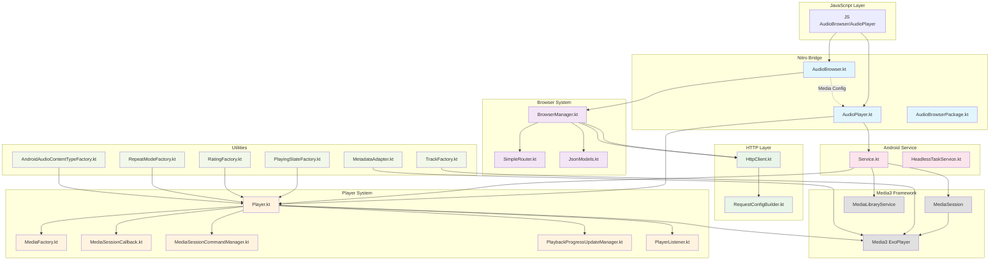

# Android Architecture Overview

This document provides an architectural overview of the Android implementation of react-native-audio-browser.

## High-Level Architecture

## Component Responsibilities

### Nitro Bridge Layer
- **AudioBrowser.kt**: Main Nitro module for browser functionality, delegates to BrowserManager
- **AudioPlayer.kt**: Main Nitro module for audio playback, manages Player lifecycle
- **AudioBrowserPackage.kt**: React Native package registration

### Browser System
- **BrowserManager.kt**: Core navigation logic, route resolution, HTTP execution
- **SimpleRouter.kt**: Client-side route matching with parameter extraction
- **JsonModels.kt**: JSON serialization models for API responses

### HTTP Layer
- **HttpClient.kt**: OkHttp wrapper for API requests
- **RequestConfigBuilder.kt**: Transforms Nitro configs to HTTP requests with merging logic

### Player System
- **Player.kt**: Core audio player implementation wrapping Media3 ExoPlayer
- **MediaFactory.kt**: Creates Media3 MediaItems from tracks with HTTP configuration
- **MediaSessionCallback.kt**: Handles media session commands and remote control events
- **MediaSessionCommandManager.kt**: Manages available media session commands
- **PlaybackProgressUpdateManager.kt**: Manages playback progress updates and seeking
- **PlayerListener.kt**: Handles ExoPlayer state changes and events

### Android Service Layer
- **Service.kt**: MediaLibraryService implementation for background playback
- **HeadlessTaskService.kt**: Handles headless tasks when app is backgrounded

### Utility Layer
- **TrackFactory.kt**: Converts Nitro Track objects to Media3 MediaItems
- **MetadataAdapter.kt**: Handles metadata extraction and conversion
- **PlayingStateFactory.kt**: Maps ExoPlayer states to Nitro PlayingState
- **RatingFactory.kt**: Handles rating conversions
- **RepeatModeFactory.kt**: Maps repeat mode between Nitro and Media3
- **AndroidAudioContentTypeFactory.kt**: Maps audio content types

## Data Flow

### Browser Navigation Flow
1. **JS** calls `audioBrowser.navigate(path)`
2. **AudioBrowser.kt** receives call via Nitro bridge
3. **BrowserManager.kt** performs route resolution using **SimpleRouter.kt**
4. For API routes: **HttpClient.kt** executes HTTP request via **RequestConfigBuilder.kt**
5. **JsonModels.kt** deserializes response to Nitro types
6. Result flows back through Nitro bridge to **JS**

### Audio Playback Flow
1. **JS** calls `audioPlayer.play(tracks)`
2. **AudioPlayer.kt** receives call and forwards to **Player.kt**
3. **TrackFactory.kt** converts tracks to Media3 MediaItems
4. **MediaFactory.kt** applies HTTP configuration for media URLs
5. **Player.kt** loads MediaItems into **Media3 ExoPlayer**
6. **Service.kt** manages **MediaSession** for system integration
7. Playback events flow back through **PlayerListener.kt** to **JS**

### Media URL Transformation
1. **AudioBrowser.kt** provides media configuration
2. **AudioPlayer.kt** registers with AudioBrowser for URL transformation
3. During playback, **MediaFactory.kt** applies transformation to track URLs
4. HTTP headers and authentication flow through to Media3 for secure playback

## Threading Model

- **Nitro calls**: Execute on MainScope coroutines
- **HTTP requests**: Execute on IO dispatcher via `withContext(Dispatchers.IO)`
- **Media3 operations**: Handled by Media3's internal threading
- **Service operations**: Run on main thread with proper lifecycle management

## Error Handling

- **HTTP errors**: Gracefully handled with fallback content and logging
- **Media errors**: Propagated through PlayerListener to JS layer
- **Configuration errors**: Validated at runtime with meaningful error messages
- **Network timeouts**: Configurable timeouts with retry logic

## Testing Strategy

- **Unit tests**: Route resolution, HTTP client, config merging
- **Integration tests**: End-to-end navigation and playback flows
- **Media3 integration**: Validated through actual playback scenarios