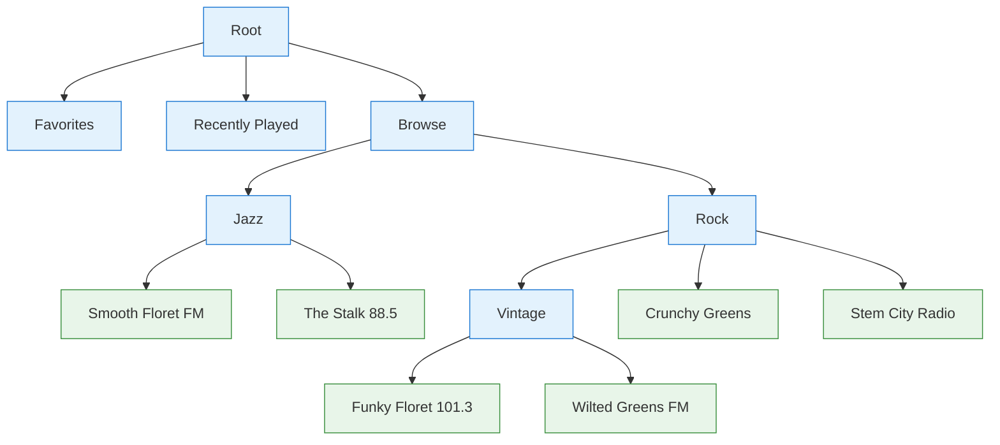
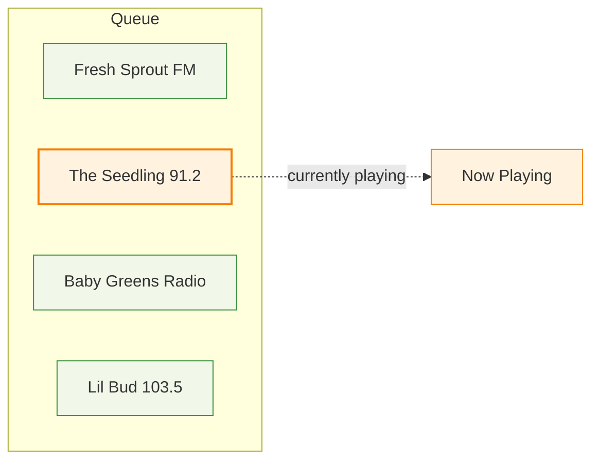

# Basic Usage

## Browser Tree Structure

The audio browser presents content as a navigable tree. This structure is required by Android Auto and CarPlay to display your content, and is also handy for apps to consume directly.

Each node can be **browsable** (a folder you can navigate into) or **playable** (a track you can play).

   Browsable (folder)
   Playable (track)

## Key Concepts

- **Browsable items** have a `url` that resolves to more children
- **Playable items** have a `src` (the audio stream URL)

## Player & Queue

The player maintains a queue of tracks. When you play a track from the browser, the queue is populated with the playable items from that context — this allows external next/previous buttons to work (Android Auto, CarPlay, headphones, etc.).

