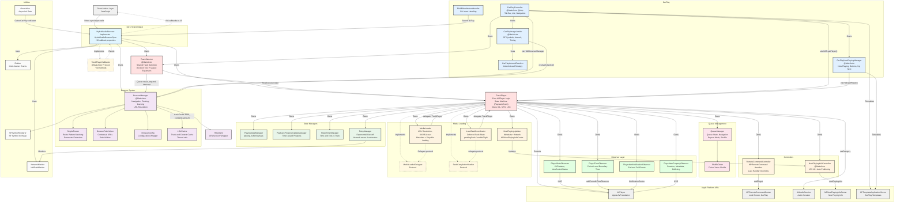

# iOS Architecture Diagram

```mermaid
graph TB
JS["React Native Layer<br/>JavaScript"]

subgraph Nitro["Nitro Hybrid Object"]
  HAB["HybridAudioBrowser<br/>Implements HybridAudioBrowserSpec<br/>~50 callback properties"]
end

TP["TrackPlayer<br/>Core AVPlayer Logic<br/>State Machine (PlaybackEvent)<br/>Owns: ML, NPU, LSC"]

TS["TrackSelector<br/>@MainActor<br/>Shared Track Selection<br/>Decision Tree + Queue Expansion"]

subgraph Queue["Queue Management"]
  QM["QueueManager<br/>Queue State, Navigation<br/>Repeat Mode, Shuffle"]
  SO["ShuffleOrder<br/>Fisher-Yates Shuffle"]
end

subgraph Browser["Browser System"]
  BM["BrowserManager<br/>@MainActor<br/>Navigation, Routing, Caching<br/>URL Resolution"]
  SR["SimpleRouter<br/>Route Pattern Matching<br/>Parameter Extraction"]
  BPH["BrowserPathHelper<br/>Contextual URLs<br/>Path Utilities"]
  BC["BrowserConfig<br/>Configuration Wrapper"]
  LRU["LRUCache<br/>Track and Content Cache<br/>Thread-safe"]
end

HC["HttpClient<br/>URLSession Wrapper"]

subgraph Platform["Apple Platform APIs"]
  AVP["AVPlayer<br/>Apple AVFoundation"]
  MPRC["MPRemoteCommandCenter<br/>Lock Screen, CarPlay"]
  AS["AVAudioSession<br/>Audio Session"]
  MPNP["MPNowPlayingInfoCenter<br/>Now Playing Info"]
  CPT["CPTemplateApplicationScene<br/>CarPlay Templates"]
end

subgraph Observers["Observer Layer"]
  PSO["PlayerStateObserver<br/>KVO status, timeControlStatus"]
  PTO["PlayerTimeObserver<br/>Periodic and Boundary Time"]
  PINO["PlayerItemNotificationObserver<br/>End and Fail Events"]
  PIPO["PlayerItemPropertyObserver<br/>Duration, Metadata, Buffering"]
end

subgraph StateManagers["State Managers"]
  PSM["PlayingStateManager<br/>playing, buffering flags"]
  PPUM["PlaybackProgressUpdateManager<br/>Timer-based Progress"]
  STM["SleepTimerManager<br/>Time and End-of-Track"]
  RM["RetryManager<br/>Exponential Backoff<br/>Network-aware Acceleration"]
end

subgraph Controllers["Controllers"]
  RCC["RemoteCommandController<br/>MPRemoteCommand Handlers<br/>Lazy Handler Overrides"]
  NPIC["NowPlayingInfoController<br/>@MainActor<br/>iOS 16+ Auto Publishing"]
end

subgraph Loaders["Media Loading"]
  ML["MediaLoader<br/>URL Resolution, AVURLAsset<br/>Metadata + Playable loading"]
  MLD["MediaLoaderDelegate<br/>Protocol"]
  NPU["NowPlayingUpdater<br/>Metadata + Artwork<br/>MPNowPlayingInfoCenter"]
  LSC["LoadSeekCoordinator<br/>Deferred Seek State<br/>pendingSeek / seekInFlight"]
  SCH["SeekCompletionHandler<br/>Protocol"]
end

subgraph CarPlay["CarPlay"]
  CPC["CarPlayController<br/>@MainActor @objc<br/>Tab Bar, List, Navigation"]
  CPIL["CarPlayImageLoader<br/>@MainActor<br/>SF Symbols, Artwork, Tinting"]
  CPAR["CarPlayArtworkResolver<br/>Artwork Load Strategy"]
  CPNPM["CarPlayNowPlayingManager<br/>@MainActor<br/>Now Playing, Buttons, Up Next"]
  MIH["RNABMediaIntentHandler<br/>Siri Intent Handling"]
end

subgraph Utilities["Utilities"]
  NM["NetworkMonitor<br/>NWPathMonitor"]
  EM["Emitter<br/>Multi-listener Events"]
  OV["OnceValue<br/>Async Init Gate"]
  SFR["SFSymbolRenderer<br/>SF Symbol to Image"]
end

TPC["TrackPlayerCallbacks<br/>@MainActor Protocol<br/>~30 methods"]

JS -->|"Direct sync/async calls"| HAB
HAB -->|Owns| TP
HAB -->|Owns| BM
HAB -->|Owns| TS
HAB -->|Uses| NM
HAB -->|Uses| EM
HAB -.->|Implements| TPC

TS -->|"Queue reuse, expand, intercept"| BM
TS -->|"Reads queue state"| TP
CPC -->|Owns| TS

BM --> SR
BM --> BPH
BM --> BC
BM --> HC
BM -->|"trackCache 3000, contentCache 20"| LRU
BM --> SFR

TP -->|Controls| AVP
TP -->|Owns| QM
TP -->|Owns| PSO
TP -->|Owns| PTO
TP -->|Owns| PINO
TP -->|Owns| PIPO
TP -->|Owns| PSM
TP -->|Owns| PPUM
TP -->|Owns| STM
TP -->|Owns| RM
TP -->|Owns| RCC
TP -->|Owns| NPIC
TP -->|Owns| ML
TP -->|Owns| NPU
TP -->|Owns| LSC
TP -.->|Implements| MLD
TP -.->|Implements| SCH
ML -.->|Delegate protocol| MLD
ML -->|delegate: TrackPlayer| TP
LSC -.->|delegate protocol| SCH
LSC -->|delegate: TrackPlayer| TP
NPU -->|Updates| NPIC

QM --> SO

PSO -->|KVO| AVP
PTO -->|addPeriodicTimeObserver| AVP
PINO -->|NotificationCenter| AVP
PIPO -->|KVO| AVP

RCC -->|addTarget| MPRC
NPIC -->|nowPlayingInfo| MPNP
TP -->|setCategory| AS
RM -->|Monitors| NM

CPC -->|Owns| CPIL
CPC -->|Owns| CPNPM
CPC -->|"via HAB.browserManager"| BM
CPC -->|"via HAB.getPlayer()"| TP
CPC -->|Templates| CPT
CPIL -->|Uses| CPAR
CPIL -->|"resolveArtworkUrl"| BM
CPNPM -->|"via HAB.getPlayer()"| TP
CPNPM -->|Templates| CPT
MIH -->|Search & Play| HAB
OV -->|"Gates CarPlay cold start"| HAB

TPC -.->|Events| HAB
HAB -.->|"~50 callbacks to JS"| JS

classDef nitro fill:#e1f5ff,stroke:#333,stroke-width:2px
classDef core fill:#ffe1e1,stroke:#333,stroke-width:2px
classDef browser fill:#f3e5f5,stroke:#333,stroke-width:2px
classDef observer fill:#e1ffe1,stroke:#333,stroke-width:2px
classDef controller fill:#fff3e1,stroke:#333,stroke-width:2px
classDef platform fill:#f0f0f0,stroke:#333,stroke-width:2px
classDef state fill:#e8f5e9,stroke:#333,stroke-width:2px
classDef util fill:#fafafa,stroke:#333,stroke-width:2px
classDef protocol fill:#fff8e1,stroke:#333,stroke-width:1px,stroke-dasharray:5 5
classDef carplay fill:#e1f0ff,stroke:#333,stroke-width:2px
classDef queue fill:#fce4ec,stroke:#333,stroke-width:2px
classDef loader fill:#fdf3e1,stroke:#333,stroke-width:2px

class HAB nitro
class TP core
class TS core
class BM,SR,BPH,BC,LRU browser
class HC browser
class PSO,PTO,PINO,PIPO observer
class RCC,NPIC controller
class AVP,MPRC,AS,MPNP,CPT,JS platform
class PSM,PPUM,STM,RM state
class NM,EM,OV,SFR util
class TPC,MLD,SCH protocol
class CPC,CPIL,CPAR,CPNPM,MIH carplay
class QM,SO queue
class ML,NPU,LSC loader
```
