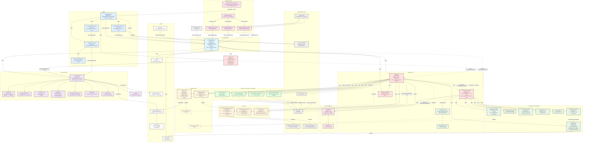

# iOS Architecture Diagram

```mermaid
graph TB
JS["React Native Layer<br/>JavaScript"]

subgraph Nitro["Nitro Hybrid Object"]
  HAB["HybridAudioBrowser<br/>@MainActor<br/>Implements TrackPlayerCallbacks<br/>~50 callbacks + ~12 Emitters<br/>Static shared (Siri/CarPlay reach)"]
end

subgraph PlaybackCore["Playback Core"]
  TP["TrackPlayer<br/>@MainActor<br/>AVPlayer bridge + observers<br/>Owns coordinator, loaders, controllers"]
  PC["PlaybackCoordinator<br/>@MainActor<br/>State machine hub + side effects<br/>Owns queue, timers, sleep, fade"]
  PSMF["nextPlaybackState()<br/>PlaybackStateMachine.swift<br/>Pure transition table"]
  PE["PlaybackEvent enum<br/>Transition triggers"]
  PStore["PlaybackStateStore<br/>UserDefaults cold-start resume"]
end

TS["TrackSelector<br/>@MainActor<br/>Shared track selection decision tree<br/>SelectionResult / PlaybackIntent"]

subgraph Queue["Queue Management"]
  QM["QueueManager<br/>@MainActor<br/>Queue state, navigation<br/>Repeat mode, shuffle"]
  SO["ShuffleOrder<br/>Fisher-Yates shuffle"]
end

subgraph CoordOwned["Coordinator-owned Managers"]
  PEH["PlaybackErrorHandler<br/>@MainActor<br/>Error classify + retry orchestration"]
  RM["RetryManager<br/>@MainActor (RetryHandling)<br/>Backoff, network-aware<br/>Split budgets: first-connect / recovery (ADR 0004)"]
  PSM["PlayingStateManager<br/>playing / buffering flags"]
  STM["SleepTimerManager<br/>@MainActor (SleepTimerHandling)<br/>Time & end-of-track"]
  PTimer["PlaybackTimer x2<br/>progressTimer + intervalTimer"]
  VF["VolumeFader<br/>Sleep-timer fade out"]
  LSC["LoadSeekCoordinator<br/>Deferred seek state machine<br/>idle / pendingSeek / seekInFlight"]
end

subgraph Browser["Browser System"]
  BM["BrowserManager<br/>@MainActor<br/>Navigation, routing, caching<br/>URL resolution, favorites"]
  SR["SimpleRouter<br/>Route pattern matching<br/>{param}, *, ** wildcards"]
  BPH["BrowserPathHelper<br/>Contextual URLs, __trackId"]
  BC["BrowserConfig<br/>Config wrapper + JS handlers"]
  LRU["LRUCache<br/>trackCache 3000, contentCache 20<br/>NSLock thread-safe"]
  MRC["MediaResolveComposer<br/>Pure URL layer composition"]
  SDI["SearchDrillIn<br/>Browsable-first 'play X' drill-in"]
  TBE["TabBarEntries<br/>Tab churn suppression"]
end

HC["HttpClient<br/>URLSession wrapper"]

subgraph Platform["Apple Platform APIs"]
  AVP["AVPlayer<br/>AVFoundation"]
  MPRC["MPRemoteCommandCenter<br/>Lock screen, CarPlay"]
  AS["AVAudioSession"]
  MPNS["MPNowPlayingSession<br/>Auto now-playing publishing"]
  CPT["CarPlay Templates<br/>CPTabBar / CPList / CPNowPlaying"]
  SK["SiriKit Intents<br/>INPlayMedia / Add / Affinity"]
end

subgraph Observers["Observer Layer (report to TrackPlayer)"]
  PSO["PlayerStateObserver<br/>KVO status, timeControlStatus"]
  PTO["PlayerTimeObserver<br/>Audio-start boundary (1ms)"]
  PINO["PlayerItemNotificationObserver<br/>End / fail / stalled"]
  PIPO["PlayerItemPropertyObserver<br/>Duration, buffering, timed metadata"]
end

subgraph Controllers["Controllers"]
  RCC["RemoteCommandController<br/>@MainActor<br/>MPRemoteCommand handlers<br/>Session command-center switching"]
  NPIC["NowPlayingInfoController<br/>@MainActor<br/>MPNowPlayingSession + nowPlayingInfo"]
  SAP["SilentAudioPrimer<br/>@MainActor<br/>Now-playing election on failed first load (ADR 0005)"]
end

subgraph Loaders["Media Loading"]
  ML["MediaLoader<br/>@MainActor<br/>URL resolution, AVURLAsset<br/>Metadata + playable loading"]
  MLD["MediaLoaderDelegate<br/>Protocol"]
  NPU["NowPlayingUpdater<br/>@MainActor<br/>Track metadata + artwork (Kingfisher)"]
  SCH["SeekCompletionHandler<br/>Protocol"]
end

subgraph CarPlay["CarPlay"]
  CPC["CarPlayController<br/>@MainActor @objc(RNABCarPlayController)<br/>Tab bar, list, navigation"]
  CPIL["CarPlayImageLoader<br/>@MainActor<br/>SF Symbols, artwork, tinting"]
  CPAR["CarPlayArtworkResolver<br/>Artwork load strategy (enum)"]
  CPLF["CarPlayListItemFactory<br/>@MainActor<br/>CPListItem / CPListSection builder"]
  CPNPM["CarPlayNowPlayingManager<br/>@MainActor<br/>Now Playing, buttons, Up Next"]
end

subgraph ObjC["Objective-C Glue"]
  SCN["RNABCarPlaySceneDelegate<br/>CPTemplateApplicationSceneDelegate<br/>Owns CarPlayController"]
  RNAB["RNABAudioBrowser<br/>Vends Siri intent handlers"]
  MIH["RNABMediaIntentHandler<br/>INPlayMediaIntent"]
  MAH["RNABMediaAddHandler<br/>INAddMediaIntent"]
  MAFH["RNABMediaAffinityHandler<br/>INUpdateMediaAffinityIntent"]
end

subgraph Utilities["Utilities"]
  NM["NetworkMonitor<br/>NWPathMonitor"]
  EM["Emitter<br/>Multi-listener events"]
  OV["OnceValue<br/>Async init gate (cold start)"]
  AIF["ArtworkImageFetcher<br/>Kingfisher + SVG/headers"]
  SFR["SFSymbolRenderer<br/>SF Symbol → file:// image"]
  SVG["SVGProcessor<br/>SVG → UIImage (SwiftDraw)"]
end

%% Entry point ownership
JS -->|"Direct sync/async calls"| HAB
HAB -->|Owns| TP
HAB -->|Owns| BM
HAB -->|Owns| TS
HAB -->|Owns| NM
HAB -->|Owns| EM
HAB -->|Owns| PStore
HAB -.->|"~50 callbacks to JS"| JS

%% Track selection
TS -->|"Queue reuse, expand, intercept"| BM
TS -.->|"player: TrackSelectionPlayer"| TP
CPC -->|Owns| TS

%% TrackPlayer ownership
TP -->|Owns| PC
TP -->|Controls| AVP
TP -->|Owns| ML
TP -->|Owns| NPU
TP -->|Owns| RCC
TP -->|Owns| NPIC
TP -->|Owns| RM
TP -->|Owns| PStore
TP -->|Owns| PSO
TP -->|Owns| PTO
TP -->|Owns| PINO
TP -->|Owns| PIPO
TP -.->|Implements| MLD
TP -.->|Implements| SCH
TP -.->|"Implements PlaybackEffectHandler"| PC

%% Coordinator hub
PC -->|Owns| QM
PC -->|Owns| PEH
PC -->|Owns| STM
PC -->|Owns| LSC
PC -->|Owns| VF
PC -->|Owns| PSM
PC -->|Owns| PTimer
PC -->|"transition(event)"| PSMF
PSMF --> PE
PC -.->|"effectHandler: TrackPlayer"| TP
PC -.->|"callbacks: HybridAudioBrowser"| HAB
PC -.->|Implements QueueManagerDelegate| QM
PEH -.->|"retryHandler: RetryHandling"| RM
QM --> SO

%% Loaders
ML -.->|Delegate| MLD
ML -->|delegate: TrackPlayer| TP
LSC -.->|Delegate| SCH
NPU -->|Updates| NPIC
NPU -->|Loads artwork| AIF

%% Browser internals
BM --> SR
BM --> BPH
BM --> BC
BM --> HC
BM --> LRU
BM --> MRC
BM --> SDI
BM --> TBE
BM -->|Artwork resolve| SFR
BM -->|Artwork fetch| AIF

%% Observers → AVPlayer
PSO -->|KVO| AVP
PTO -->|Boundary observer| AVP
PINO -->|NotificationCenter| AVP
PIPO -->|KVO + metadata output| AVP

%% Platform
RCC -->|addTarget| MPRC
NPIC -->|linkPlayer| MPNS
TP -->|Owns, primes on failed first load| SAP
TP -->|setCategory| AS
RM -->|Monitors| NM
AIF --> SVG

%% CarPlay
SCN -->|"didConnect → start()"| CPC
RNAB -->|handlerForIntent| MIH
RNAB -->|handlerForIntent| MAH
RNAB -->|handlerForIntent| MAFH
CPC -->|Owns| CPIL
CPC -->|Owns| CPLF
CPC -->|Owns| CPNPM
CPC -->|"weak audioBrowser"| HAB
CPC -->|Templates| CPT
CPIL -->|weak browserManager| BM
CPIL -->|Uses| CPAR
CPLF -->|weak imageLoader| CPIL
CPNPM -->|weak audioBrowser| HAB
CPNPM -->|Templates| CPT
MIH -->|"handlePlayMediaIntent"| HAB
MAH -->|"setActiveTrackFavorited"| HAB
MAFH -->|"setActiveTrackFavorited"| HAB
SK --> MIH
SK --> MAH
SK --> MAFH
OV -->|"Gates CarPlay cold start"| HAB

classDef nitro fill:#e1f5ff,stroke:#333,stroke-width:2px
classDef core fill:#ffe1e1,stroke:#333,stroke-width:2px
classDef browser fill:#f3e5f5,stroke:#333,stroke-width:2px
classDef observer fill:#e1ffe1,stroke:#333,stroke-width:2px
classDef controller fill:#fff3e1,stroke:#333,stroke-width:2px
classDef platform fill:#f0f0f0,stroke:#333,stroke-width:2px
classDef state fill:#e8f5e9,stroke:#333,stroke-width:2px
classDef util fill:#fafafa,stroke:#333,stroke-width:2px
classDef protocol fill:#fff8e1,stroke:#333,stroke-width:1px,stroke-dasharray:5 5
classDef carplay fill:#e1f0ff,stroke:#333,stroke-width:2px
classDef objc fill:#ffe1f0,stroke:#333,stroke-width:2px
classDef queue fill:#fce4ec,stroke:#333,stroke-width:2px
classDef loader fill:#fdf3e1,stroke:#333,stroke-width:2px

class HAB nitro
class TP,PC,PStore core
class TS core
class PSMF,PE state
class BM,SR,BPH,BC,LRU,MRC,SDI,TBE browser
class HC browser
class PSO,PTO,PINO,PIPO observer
class RCC,NPIC,SAP controller
class AVP,MPRC,AS,MPNS,CPT,SK,JS platform
class PEH,RM,PSM,STM,PTimer,VF,LSC state
class NM,EM,OV,AIF,SFR,SVG util
class MLD,SCH protocol
class CPC,CPIL,CPAR,CPLF,CPNPM carplay
class SCN,RNAB,MIH,MAH,MAFH objc
class QM,SO queue
class ML,NPU loader
```
