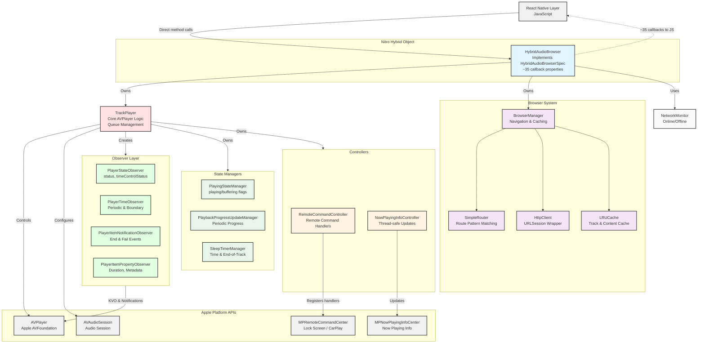

# iOS Development Guide

## Quick Commands

- `yarn ios:rebuild` - Rebuild and run with pod install (required after adding/removing files)
- `yarn ios:format` - Format Swift code

## Architecture



## Key Architecture Points

### Nitro Module Pattern
- `HybridAudioBrowser` is the single entry point, implementing `HybridAudioBrowserSpec`
- Unified interface for both browsing and playback functionality
- Direct JS-native method calls (no event emitters)
- ~35 callbacks as closure properties (e.g., `onPlaybackProgressUpdated`, `onPathChanged`)
- Types generated by Nitrogen in `nitrogen/generated/ios/swift/`

### Relationship to RNTP
This codebase is adapted from react-native-track-player. Key differences:
- **Bridge layer removed** - No `TrackPlayerModule.swift`, no Obj-C bridge
- **Nitro types used** - `Track`, `PlayingState`, events from nitrogen/generated
- **Browser added** - Navigation, routing, HTTP client (not in RNTP)
- **Unified API** - Browser and player merged into single HybridAudioBrowser

## Project Structure

```
ios/
├── HybridAudioBrowser.swift          # Main Nitro entry point (~900 lines)
├── TrackPlayer.swift                 # Core AVPlayer logic (~1200 lines)
├── TrackPlayerCallbacks.swift        # Internal callback protocol
├── Browser/
│   ├── BrowserManager.swift          # Navigation, routing, caching (~640 lines)
│   ├── SimpleRouter.swift            # Route pattern matching (~190 lines)
│   ├── BrowserConfig.swift           # Configuration wrapper
│   ├── BrowserPathHelper.swift       # Path utilities & contextual URLs
│   └── JsonModels.swift              # JSON codable models
├── Observer/
│   ├── PlayerStateObserver.swift     # KVO for AVPlayer status
│   ├── PlayerTimeObserver.swift      # Periodic & boundary time events
│   ├── PlayerItemNotificationObserver.swift  # Track end/fail notifications
│   └── PlayerItemPropertyObserver.swift      # Duration, metadata output
├── Player/
│   ├── PlayingStateManager.swift     # Computes playing/buffering state
│   ├── SleepTimerManager.swift       # Sleep timer (time & end-of-track)
│   └── PlaybackProgressUpdateManager.swift   # Periodic progress events
├── NowPlayingInfo/
│   ├── NowPlayingInfoController.swift # Thread-safe MPNowPlayingInfoCenter
│   ├── NowPlayingInfoCenter.swift    # Protocol for testability
│   ├── MediaItemProperty.swift       # Track metadata properties
│   └── NowPlayingInfoProperty.swift  # Playback state properties
├── RemoteCommand/
│   └── RemoteCommandController.swift # MPRemoteCommandCenter handlers
├── Http/
│   └── HttpClient.swift              # URLSession wrapper (~210 lines)
├── Model/
│   ├── TrackPlayerError.swift        # PlaybackError, QueueError
│   ├── MediaURL.swift                # URL parsing
│   ├── SourceType.swift              # file vs stream
│   └── PlayerUpdateOptions.swift     # Update options
├── Extension/
│   ├── Track+AVPlayer.swift          # Track playback utilities
│   └── Capability+RemoteCommand.swift
├── Option/
│   ├── PitchAlgorithms.swift         # Pitch algorithm enum
│   ├── TimeEventFrequency.swift      # Event frequency enum
│   └── SessionCategories.swift       # Audio session categories
├── Util/
│   ├── LRUCache.swift                # Thread-safe LRU cache (~185 lines)
│   ├── MetadataAdapter.swift         # Metadata parsing
│   └── NetworkMonitor.swift          # Online/offline detection
└── Support/
    └── Bridge.h                       # Objective-C bridge header
```

## Type Mapping

Nitro generates types that must be used instead of RNTP types:

| Nitro Type (use this) | RNTP Type (removed) |
|-----------------------|---------------------|
| `Track` | `ios/Model/Track.swift` |
| `PlayingState` | `ios/Model/PlaybackPlayingState.swift` |
| `RepeatMode` | `ios/Option/RepeatMode.swift` |
| `PlaybackProgressUpdatedEvent` | `ios/Event/PlaybackProgressUpdatedEvent.swift` |
| etc. | etc. |

## Implementation Notes

### Track Type
The Nitro `Track` has:
- `url: String?` - Browsable path (for navigation)
- `src: String?` - Playback URL (for AVPlayer)
- `artwork: String?` - Artwork URL
- `artworkSource: ImageSource?` - Detailed artwork config

Use `track.src ?? track.url` for AVPlayer URL.

### Callbacks
HybridAudioBrowserSpec defines ~35 callbacks as properties:
```swift
// Browser callbacks
var onPathChanged: ((PathChangedEvent) -> Void)?
var onContentChanged: ((ContentChangedEvent) -> Void)?
var onTabsChanged: (([Track]) -> Void)?
var onNavigationError: ((NavigationError) -> Void)?

// Playback callbacks
var onPlaybackProgressUpdated: ((PlaybackProgressUpdatedEvent) -> Void)?
var onPlaybackActiveTrackChanged: ((PlaybackActiveTrackChangedEvent) -> Void)?
var onPlaybackPlayingState: ((PlayingState) -> Void)?
var onPlaybackError: ((PlaybackError) -> Void)?

// Remote callbacks (with optional handler overrides)
var onRemotePlay: (() -> Void)?
var handleRemotePlay: (() -> Void)?  // Override default behavior
// etc.
```

Set these from TrackPlayer events, BrowserManager, or observer closures.

### Promises
Async methods return `Promise<T>`:
```swift
func setupPlayer(options: PartialSetupPlayerOptions) throws -> Promise<Void>
```

Use Nitro's Promise helpers for async operations.

### Logging
**Always use `os.Logger` instead of `print()` for debugging.**

```swift
import os.log

class MyClass {
    private let logger = Logger(subsystem: "com.audiobrowser", category: "MyClass")

    func doSomething() {
        logger.debug("Debug message")
        logger.info("Info message")
        logger.error("Error message")
    }
}
```

- Use `logger.debug()` for development debugging
- Use `logger.info()` for general information
- Use `logger.error()` for errors
- See `HttpClient.swift` for a complete example
