# iOS Development Guide

## Quick Commands

- `yarn ios:rebuild` - Rebuild and run with pod install (required after adding/removing files)
- `yarn ios:format` - Format Swift code

## Architecture

```mermaid
graph TB
JS["React Native Layer<br/>JavaScript"]

subgraph Nitro["Nitro Hybrid Object"]
  HAB["HybridAudioBrowser<br/>Implements HybridAudioBrowserSpec<br/>~50 callback properties"]
end

TP["TrackPlayer<br/>Core AVPlayer Logic<br/>Queue Management<br/>~1280 lines"]

subgraph Browser["Browser System"]
  BM["BrowserManager<br/>Navigation, Routing, Caching<br/>URL Resolution ~870 lines"]
  SR["SimpleRouter<br/>Route Pattern Matching<br/>Parameter Extraction"]
  BPH["BrowserPathHelper<br/>Contextual URLs<br/>Path Utilities"]
  BC["BrowserConfig<br/>Configuration Wrapper"]
  HC["HttpClient<br/>URLSession Wrapper"]
  LRU["LRUCache<br/>Track and Content Cache<br/>Thread-safe"]
end

subgraph Platform["Apple Platform APIs"]
  AVP["AVPlayer<br/>Apple AVFoundation"]
  MPRC["MPRemoteCommandCenter<br/>Lock Screen, CarPlay"]
  AS["AVAudioSession<br/>Audio Session"]
  MPNP["MPNowPlayingInfoCenter<br/>Now Playing Info"]
end

subgraph Observers["Observer Layer"]
  PSO["PlayerStateObserver<br/>KVO status, timeControlStatus"]
  PTO["PlayerTimeObserver<br/>Periodic and Boundary Time"]
  PINO["PlayerItemNotificationObserver<br/>End and Fail Events"]
  PIPO["PlayerItemPropertyObserver<br/>Duration, Metadata, Buffering"]
end

subgraph StateManagers["State Managers"]
  PSM["PlayingStateManager<br/>playing, buffering flags"]
  PPUM["PlaybackProgressUpdateManager<br/>Timer-based Progress"]
  STM["SleepTimerManager<br/>Time and End-of-Track"]
end

subgraph Controllers["Controllers"]
  RCC["RemoteCommandController<br/>MPRemoteCommand Handlers<br/>Lazy Handler Overrides"]
  NPIC["NowPlayingInfoController<br/>Thread-safe Queue<br/>Batched Updates"]
end

NM["NetworkMonitor<br/>NWPathMonitor<br/>Online, Offline"]

TPC["TrackPlayerCallbacks<br/>Protocol ~30 methods"]

JS -->|"Direct sync/async calls"| HAB
HAB -->|Owns| TP
HAB -->|Owns| BM
HAB -->|Uses| NM
HAB -.->|Implements| TPC

BM --> SR
BM --> BPH
BM --> BC
BM --> HC
BM -->|"trackCache 3000, contentCache 20"| LRU

TP -->|Controls| AVP
TP -->|Owns| PSO
TP -->|Owns| PTO
TP -->|Owns| PINO
TP -->|Owns| PIPO
TP -->|Owns| PSM
TP -->|Owns| PPUM
TP -->|Owns| STM
TP -->|Owns| RCC
TP -->|Owns| NPIC

PSO -->|KVO| AVP
PTO -->|addPeriodicTimeObserver| AVP
PINO -->|NotificationCenter| AVP
PIPO -->|KVO| AVP

RCC -->|addTarget| MPRC
NPIC -->|nowPlayingInfo| MPNP
TP -->|setCategory| AS

TPC -.->|Events| HAB
HAB -.->|"~50 callbacks to JS"| JS

classDef nitro fill:#e1f5ff,stroke:#333,stroke-width:2px
classDef core fill:#ffe1e1,stroke:#333,stroke-width:2px
classDef browser fill:#f3e5f5,stroke:#333,stroke-width:2px
classDef observer fill:#e1ffe1,stroke:#333,stroke-width:2px
classDef controller fill:#fff3e1,stroke:#333,stroke-width:2px
classDef platform fill:#f0f0f0,stroke:#333,stroke-width:2px
classDef state fill:#e8f5e9,stroke:#333,stroke-width:2px
classDef util fill:#fafafa,stroke:#333,stroke-width:2px
classDef protocol fill:#fff8e1,stroke:#333,stroke-width:1px,stroke-dasharray:5 5

class HAB nitro
class TP core
class BM,SR,BPH,BC,HC,LRU browser
class PSO,PTO,PINO,PIPO observer
class RCC,NPIC controller
class AVP,MPRC,AS,MPNP,JS platform
class PSM,PPUM,STM state
class NM util
class TPC protocol
```



## Key Architecture Points

### Nitro Module Pattern
- `HybridAudioBrowser` is the single entry point, implementing `HybridAudioBrowserSpec`
- Unified interface for both browsing and playback functionality
- Direct JS-native method calls (no event emitters)
- ~50 callbacks as closure properties organized into categories:
  - **Browser** (4): `onPathChanged`, `onContentChanged`, `onTabsChanged`, `onNavigationError`
  - **Player** (14): `onPlaybackProgressUpdated`, `onPlaybackActiveTrackChanged`, `onPlaybackPlayingState`, etc.
  - **Remote** (16): `onRemotePlay`, `onRemotePause`, `onRemoteNext`, etc.
  - **Remote Handlers** (14): `handleRemotePlay`, `handleRemotePause`, etc. (optional JS overrides)
  - **Other** (8): `onOptionsChanged`, `onFavoriteChanged`, `onNowPlayingChanged`, `onOnlineChanged`, etc.
- Types generated by Nitrogen in `nitrogen/generated/ios/swift/`

### Data Flow
1. **JS → Native**: Direct sync/async method calls via Nitro
2. **Native → JS**: Callback properties invoked from native code
3. **Browser → Player**: `navigateTrack()` can expand contextual URLs and load queue
4. **Player → Controllers**: TrackPlayer owns RemoteCommandController and NowPlayingInfoController
5. **Platform → Observers**: KVO and NotificationCenter feed back to TrackPlayer

### Thread Safety
- `HybridAudioBrowser.onMainThread()` ensures player operations run on main thread
- `NowPlayingInfoController` uses concurrent queue with barriers
- `LRUCache` uses NSLock for thread-safe access
- `BrowserManager` asserts main thread for state modifications

### Relationship to RNTP
This codebase is adapted from react-native-track-player. Key differences:
- **Bridge layer removed** - No `TrackPlayerModule.swift`, no Obj-C bridge
- **Nitro types used** - `Track`, `PlayingState`, events from nitrogen/generated
- **Browser added** - Navigation, routing, HTTP client (not in RNTP)
- **Unified API** - Browser and player merged into single HybridAudioBrowser
- **URL Resolution** - Media and artwork URL transforms via configuration

## Project Structure

```
ios/
├── HybridAudioBrowser.swift          # Main Nitro entry point (~910 lines)
│                                     # Implements HybridAudioBrowserSpec & TrackPlayerCallbacks
│                                     # ~50 callback properties (browser, player, remote)
├── TrackPlayer.swift                 # Core AVPlayer logic (~1280 lines)
│                                     # Queue management, media URL resolution
│                                     # Owns all observers, state managers, controllers
├── TrackPlayerCallbacks.swift        # Internal callback protocol (~30 methods)
│                                     # Bridge between TrackPlayer events and HybridAudioBrowser
├── Browser/
│   ├── BrowserManager.swift          # Navigation, routing, caching (~870 lines)
│   │                                 # URL resolution (media, artwork)
│   │                                 # Favorites hydration, queue expansion
│   ├── SimpleRouter.swift            # Route pattern matching (~185 lines)
│   │                                 # Supports {param}, *, ** wildcards
│   │                                 # Specificity-based best match
│   ├── BrowserConfig.swift           # Configuration wrapper
│   ├── BrowserPathHelper.swift       # Path utilities & contextual URLs
│   │                                 # __trackId encoding for playable-only tracks
│   └── JsonModels.swift              # JSON Codable models for API responses
├── Observer/
│   ├── PlayerStateObserver.swift     # KVO: AVPlayer.status, timeControlStatus
│   ├── PlayerTimeObserver.swift      # Periodic & boundary time events
│   ├── PlayerItemNotificationObserver.swift  # Track end/fail notifications
│   └── PlayerItemPropertyObserver.swift      # Duration, metadata, buffering
├── Player/
│   ├── PlayingStateManager.swift     # Computes playing/buffering state
│   ├── SleepTimerManager.swift       # Sleep timer (time & end-of-track)
│   │                                 # Supports both countdown and track-end modes
│   └── PlaybackProgressUpdateManager.swift   # Timer-based periodic progress
├── NowPlayingInfo/
│   ├── NowPlayingInfoController.swift # Thread-safe MPNowPlayingInfoCenter
│   │                                 # Concurrent queue with barriers
│   ├── NowPlayingInfoCenter.swift    # Protocol for testability
│   ├── NowPlayingInfoKeyValue.swift  # Key-value protocol
│   ├── MediaItemProperty.swift       # Track metadata properties
│   └── NowPlayingInfoProperty.swift  # Playback state properties
├── RemoteCommand/
│   └── RemoteCommandController.swift # MPRemoteCommandCenter handlers (~285 lines)
│                                     # Lazy handler properties for customization
├── Http/
│   └── HttpClient.swift              # URLSession wrapper (~230 lines)
│                                     # JSON decoding with detailed errors
├── Model/
│   ├── TrackPlayerError.swift        # PlaybackError, QueueError
│   ├── MediaURL.swift                # URL parsing utilities
│   ├── RemoteCommand.swift           # Remote command enum with config
│   ├── SourceType.swift              # file vs stream detection
│   └── PlayerUpdateOptions.swift     # Update options struct
├── Extension/
│   ├── Track+AVPlayer.swift          # Track artwork loading
│   └── Capability+RemoteCommand.swift # Capability to RemoteCommand conversion
├── Option/
│   ├── PitchAlgorithms.swift         # AVAudioTimePitchAlgorithm mapping
│   ├── TimeEventFrequency.swift      # Event frequency enum
│   └── SessionCategories.swift       # Audio session categories
├── Util/
│   ├── LRUCache.swift                # Thread-safe LRU cache (~183 lines)
│   │                                 # O(1) get/set with doubly-linked list
│   ├── MetadataAdapter.swift         # AVMetadataItem parsing
│   └── NetworkMonitor.swift          # NWPathMonitor wrapper
└── Support/
    └── Bridge.h                       # Objective-C bridge header
```

## Type Mapping

Nitro generates types that must be used instead of RNTP types:

| Nitro Type (use this) | RNTP Type (removed) |
|-----------------------|---------------------|
| `Track` | `ios/Model/Track.swift` |
| `PlayingState` | `ios/Model/PlaybackPlayingState.swift` |
| `RepeatMode` | `ios/Option/RepeatMode.swift` |
| `PlaybackProgressUpdatedEvent` | `ios/Event/PlaybackProgressUpdatedEvent.swift` |
| etc. | etc. |

## Implementation Notes

### Track Type
The Nitro `Track` has:
- `url: String?` - Browsable path (for navigation)
- `src: String?` - Playback URL (for AVPlayer)
- `artwork: String?` - Artwork URL
- `artworkSource: ImageSource?` - Detailed artwork config

Use `track.src ?? track.url` for AVPlayer URL.

### Callbacks
HybridAudioBrowserSpec defines ~50 callbacks as properties:
```swift
// Browser callbacks (4)
var onPathChanged: (String) -> Void = { _ in }
var onContentChanged: (ResolvedTrack?) -> Void = { _ in }
var onTabsChanged: ([Track]) -> Void = { _ in }
var onNavigationError: (NavigationErrorEvent) -> Void = { _ in }

// Playback callbacks (14)
var onPlaybackProgressUpdated: (PlaybackProgressUpdatedEvent) -> Void = { _ in }
var onPlaybackActiveTrackChanged: (PlaybackActiveTrackChangedEvent) -> Void = { _ in }
var onPlaybackPlayingState: (PlayingState) -> Void = { _ in }
var onPlaybackError: (PlaybackErrorEvent) -> Void = { _ in }
var onPlaybackChanged: (Playback) -> Void = { _ in }
// ...etc

// Remote callbacks (16) - fire events to JS
var onRemotePlay: () -> Void = {}
var onRemotePause: () -> Void = {}
var onRemoteNext: () -> Void = {}
// ...etc

// Remote handlers (14) - optional JS overrides for default behavior
var handleRemotePlay: (() -> Void)?     // If set, overrides default
var handleRemotePause: (() -> Void)?
var handleRemoteNext: (() -> Void)?
// ...etc
```

Callbacks are set from:
- `TrackPlayerCallbacks` protocol methods (player events)
- `BrowserManager` callbacks (navigation events)
- `NetworkMonitor.onChanged` (connectivity)
- `SleepTimerManager.onChanged` (sleep timer)

### Promises
Async methods return `Promise<T>`:
```swift
func setupPlayer(options: PartialSetupPlayerOptions) throws -> Promise<Void>
```

Use Nitro's Promise helpers for async operations.

### Logging
**Always use `os.Logger` instead of `print()` for debugging.**

```swift
import os.log

class MyClass {
    private let logger = Logger(subsystem: "com.audiobrowser", category: "MyClass")

    func doSomething() {
        logger.debug("Debug message")
        logger.info("Info message")
        logger.error("Error message")
    }
}
```

- Use `logger.debug()` for development debugging
- Use `logger.info()` for general information
- Use `logger.error()` for errors
- See `HttpClient.swift` for a complete example
