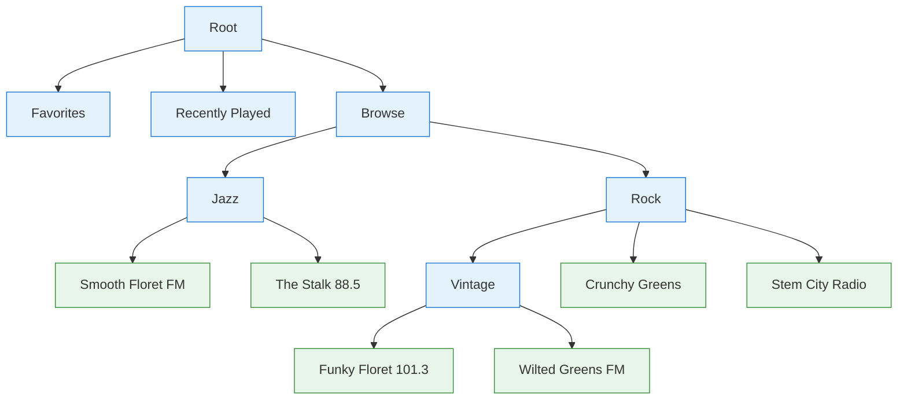

# Basic Usage

This guide covers the core idea — the **browse tree** — and the minimal code to set up the player, define some content, and play it. Installation is in [Getting Started](/guide/getting-started).

## The browse tree

The library models all content as one navigable tree of **Tracks**. A single Track is **browsable**, **playable**, or both, depending on which fields you set:

- **Browsable** — has a `path`; navigating into it resolves its children.
- **Playable** — has a `src`; the player can stream it.

Three fields at a glance — each answers a different question about a Track:

| Field  | Answers            | Meaning                                    |
| ------ | ------------------ | ------------------------------------------ |
| `path` | where does it go?  | the browse-tree address navigating opens   |
| `src`  | what does it play? | the media identifier the player streams    |
| `id`   | which item is it?  | stable identity across surfaces (optional) |



<div style="display: flex; gap: 1rem; margin-top: 0.5rem; font-size: 0.9em;">
  <span><span style="display: inline-block; width: 12px; height: 12px; background: #e3f2fd; border: 1px solid #1976d2; margin-right: 4px;"></span> Browsable: opens to children</span>
  <span><span style="display: inline-block; width: 12px; height: 12px; background: #e8f5e9; border: 1px solid #388e3c; margin-right: 4px;"></span> Playable: streams audio</span>
</div>

One tree powers both your in-app UI and the native browse views on CarPlay and Android Auto.

## Set up the player

Call `setupPlayer()` once at startup to initialize the player:

```ts
import { setupPlayer } from 'react-native-audio-browser'

await setupPlayer()
```

## Define a browse tree

Describe the tree with `configureBrowser`: **tabs** along the top, and **routes** that resolve each path to its children. The simplest source is static data declared inline:

```ts
import { configureBrowser } from 'react-native-audio-browser'

configureBrowser({
  tabs: [{ title: 'Browse', path: '/browse' }],
  routes: {
    '/browse': {
      path: '/browse',
      title: 'Browse',
      children: [
        {
          title: 'Jazz',
          // A path makes this browsable — tapping it opens that path.
          path: '/browse/jazz'
        },
        {
          title: 'Smooth Floret FM',
          // A src makes this playable — tapping it streams the track.
          src: 'https://example.com/floret.mp3'
        }
      ]
    },
    '/browse/jazz': {
      path: '/browse/jazz',
      title: 'Jazz',
      children: [
        {
          title: 'The Stalk 88.5',
          src: 'https://example.com/stalk.mp3'
        }
      ]
    }
  }
})
```

A route value is a [`BrowserSource`](/api/types/browser/#browsersource): the static page object shown above, an **async callback** that returns one (`'/path': async ({ routeParams }) => ({ title, children })`), or an HTTP request config that fetches it from your API — handy for trees too large to declare upfront.

## Play a track

On CarPlay and Android Auto, tapping a playable Track plays it for you. To drive playback from your own UI, set a queue and call `play`:

```ts
import { setQueue, play } from 'react-native-audio-browser'

setQueue([{ title: 'Smooth Floret FM', src: 'https://example.com/floret.mp3' }])
play()
```

## The queue

The player works through a **queue** of Tracks. The Track at the current position is the **active track** — it's what plays, and what external next/previous controls (car, headphones, lock screen) move between.

**Now Playing** is the metadata shown on the lock screen, notification, and car surfaces. By default it mirrors the active track; for live streams you can override it as the current song changes — see [Now Playing](/guide/now-playing).

## Read state in your UI

Reactive hooks keep your in-app UI in sync with playback — they re-render automatically as it changes:

```tsx
import {
  togglePlayback,
  usePlayingState,
  useActiveTrack
} from 'react-native-audio-browser'

function PlayPauseButton() {
  const { playing } = usePlayingState()
  const track = useActiveTrack()

  return (
    <Button
      title={playing ? `Pause ${track?.title ?? ''}` : 'Play'}
      onPress={() => togglePlayback()}
    />
  )
}
```

See the [API reference](/api/) for the full set of hooks (`useProgress`, `useQueue`, `useNowPlaying`, and more).
