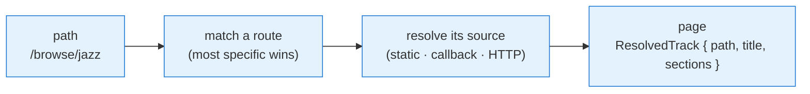

# Browser

The **Browser** is the subsystem that turns one declarative description of your content into a navigable tree — the same tree that powers your in-app browse UI, CarPlay, and Android Auto. You describe it once with **`configureBrowser`**; the library resolves paths, fetches children, transforms requests, and renders the native surfaces for you.

[Basic Usage](/guide/basic-usage) introduces the browse tree. This guide is the reference for _configuring_ it: every source shape, every routing pattern, and every option on [`BrowserConfiguration`](/api/types/browser/#browserconfiguration).

## A complete example

Here is a full, runnable configuration — call `setupPlayer` once, then `configureBrowser` once. It has two tabs, one **static** route, and one **callback** route. Paste it, swap in your own content, and you have a working browse tree on phone, CarPlay, and Android Auto.

```ts
import { setupPlayer, configureBrowser } from 'react-native-audio-browser'

await setupPlayer()

configureBrowser({
  tabs: [
    { title: 'Browse', path: '/browse' },
    { title: 'Favorites', path: '/favorites' }
  ],
  routes: {
    // Static data declared inline:
    '/browse': {
      path: '/browse',
      title: 'Browse',
      children: [
        // browsable — has a path
        { title: 'Jazz', path: '/browse/jazz' },
        // playable — has a src
        { title: 'Smooth Floret FM', src: 'https://example.com/floret.mp3' }
      ]
    },
    // Resolved on demand from your own code:
    '/browse/jazz': async () => {
      const stations = await fetchJazzStations() // your code
      return { path: '/browse/jazz', title: 'Jazz', children: stations }
    }
  }
})
```

::: tip "Your code" vs. library API
Helpers like `fetchJazzStations`, `fetchAlbum`, `getLocalFavoriteIds`, and `getDomain` throughout this guide are **your** functions, not library exports — they stand in for however your app gets its data. Only imports from `react-native-audio-browser` are library API.
:::

Calling `configureBrowser` again **replaces** the entire configuration — see [Updating the configuration](#updating-the-configuration). The rest of this guide unpacks each part.

## How a path resolves

Everything the Browser shows is the result of resolving a **path** (a string like `/browse/jazz`) to a **page** — a Track carrying its content. The flow is always the same:



A **page** is a [`ResolvedTrack`](/api/types/browser-nodes/#resolvedtrack): it requires a `path` and a `title`, and carries its content as `sections` — an array of [`Section`](/api/types/browser-nodes/#section)s, each a titled, styled group of [`Track`](/api/types/browser-nodes/#track)s:

```ts
{
  path: '/home',
  title: 'Home',
  sections: [
    { title: 'Popular', style: 'grid-row', path: '/popular', children: [...] },
    { title: 'All stations', children: [...] }
  ]
}
```

A Section is `{ title?, subtitle?, style?, path?, children }`: `title` renders as a header above its tracks, `style` picks their layout (`'list'` rows — the default — `'grid'` wrapping artwork tiles, or `'grid-row'`, a single line of tiles), and `path` is the navigation target for the header / "view all" surface. See [Presentation](#presentation) for how each surface renders the styles.

A flat page doesn't have to spell that out: authoring a plain `children: Track[]` — as most examples in this guide do — is sugar for one untitled section. Resolved output always carries `sections`; `children` is never populated on a resolved page.

So configuring the Browser is really three decisions, covered in turn below: **what routes exist**, **what source each route resolves from**, and **how requests are shaped** along the way.

## Source shapes

Wherever the Browser needs content — a route, the `tabs`, `search` — you supply a **source**, and a source is always one of three shapes. Learn these once; they apply everywhere.

### 1. Static data

A page object you declare inline. Best for small, fixed trees.

```ts
configureBrowser({
  routes: {
    '/browse': {
      path: '/browse',
      title: 'Browse',
      children: [
        // browsable — has a path
        { title: 'Jazz', path: '/browse/jazz' },
        // playable — has a src
        { title: 'Smooth Floret FM', src: 'https://example.com/floret.mp3' }
      ]
    }
  }
})
```

### 2. A callback

A function `({ path, routeParams }) => ResolvedTrack` (sync or async). Resolve children from anywhere — memory, a database, your own fetch logic. Best for trees too large to declare upfront, or content that depends on runtime state.

```ts
configureBrowser({
  routes: {
    '/albums/{id}': async ({ routeParams }) => {
      const album = await fetchAlbum(routeParams.id) // your code
      return {
        path: `/albums/${album.id}`,
        title: album.name,
        children: album.tracks
      }
    }
  }
})
```

Return `{ error: 'message' }` instead of a page to signal a failure the Browser should surface — see [Error handling](#error-handling).

### 3. An HTTP endpoint

A [`TransformableRequestConfig`](/api/types/browser/#transformablerequestconfig). The library issues the request **natively** (so browse works on a cold car start with your JS not yet running) and expects a page object — a `ResolvedTrack` — back.

The key convenience: with a `baseUrl` set, **any path with no explicit route is fetched over HTTP automatically** — the navigated path becomes the request path. So a fully server-driven tree may need _no_ `routes` at all:

```ts
configureBrowser({
  // GET https://api.example.com/browse/jazz
  // (the navigated path flows through automatically)
  request: { baseUrl: 'https://api.example.com' }
})
```

::: warning A static `path` does not rewrite the request path
On an HTTP route, the _navigated_ path is used as the request path — a static `path` field is ignored for this. To remap (e.g. send `/favorites` to `/favorites/v2`), use a [transform](#transforms-per-request), which also receives `routeParams`.
:::

::: tip Same three shapes, everywhere
`tabs` and `search` accept these same shapes. Once you know static vs. callback vs. HTTP, you know how to configure every part of the Browser. For example, `search` as a callback is just another source returning tracks:

```ts
configureBrowser({
  search: async ({ query }) => searchStations(query) // your code → Track[]
})
```

Search has its own depth (voice intents, query modes) — see [Search](/guide/search).
:::

## Tabs and the initial path

`tabs` are the top-level entry points — the segmented control in your app, the tab bar on CarPlay, the root of the Android Auto tree. Each tab is a Track with a `title` and a `path` pointing at a route.

```ts
configureBrowser({
  tabs: [
    { title: 'Home', path: '/home' },
    { title: 'Favorites', path: '/favorites' },
    { title: 'Browse', path: '/browse' }
  ]
})
```

::: warning Maximum 4 tabs
CarPlay and Android Auto cap the tab bar, so `tabs` is limited to **4**. More than four triggers a runtime warning and the extras are dropped.
:::

Like any source, `tabs` can also be a **callback** — useful when the tabs themselves depend on runtime state, such as a debug build or the current user:

```ts
configureBrowser({
  tabs: () => [
    { title: 'Home', path: '/home' },
    { title: 'Favorites', path: '/favorites' },
    ...(__DEV__ ? [{ title: 'Debug', path: '/debug' }] : [])
  ]
})
```

…or an **HTTP endpoint** returning a page (`{ children: Track[] }`).

**Initial path.** The Browser opens to the first tab's `path` by default. Set `path` to start somewhere else:

```ts
configureBrowser({
  path: '/home', // where browse opens; defaults to the first tab's path (or '/')
  tabs: [
    /* … */
  ]
})
```

## Routes

`routes` maps **path patterns** to sources. When the Browser resolves a path, it finds the matching pattern and resolves that pattern's source.

### Pattern syntax

Patterns match on **exact segment count** first — `/artists` does _not_ match `/artists/123`. Within that, a segment can be:

| Pattern        | Matches                                                   | Captured           |
| -------------- | --------------------------------------------------------- | ------------------ |
| `/favorites`   | exactly `/favorites`                                      | —                  |
| `/albums/{id}` | `/albums/floret`, `/albums/42`                            | `routeParams.id`   |
| `/artists/*`   | any single segment at that position (`/artists/anything`) | —                  |
| `/files/**`    | `/files/...` at any depth below                           | `routeParams.tail` |

When several patterns match, **most specific wins**: constant > `{param}` > `*` > `**`. So `/albums/new` and `/albums/{id}` can coexist — `/albums/new` takes the literal route.

```ts
configureBrowser({
  routes: {
    // literal — checked first
    '/albums/new': newReleasesPage,
    // {id} otherwise
    '/albums/{id}': ({ routeParams }) => fetchAlbum(routeParams.id),
    // deep file paths
    '/files/**': ({ routeParams }) => listFiles(routeParams.tail)
  }
})
```

::: warning The bare `'*'` key is the _default_, not a wildcard segment
A single-segment wildcard only works as a `*` **segment inside a longer pattern** (e.g. `/artists/*`). The bare top-level key `'*'` is different: it's the **custom default** — the source used for any path no other route matches (and only needed if you want to override the built-in HTTP default).

```ts
routes: {
  // wildcard segment — matches /artists/<one segment>
  '/artists/*': handleArtist,
  // default for everything unmatched
  '*': { baseUrl: 'https://api.example.com' }
}
```

:::

### Route parameters

A callback (or transform) receives the captured params in `routeParams`:

```ts
'/stations/{country}/{city}': async ({ routeParams }) => {
  // /stations/nl/amsterdam → { country: 'nl', city: 'amsterdam' }
  return fetchStations(routeParams.country, routeParams.city)
}
```

### Per-route overrides

A route value can be a bare source (the common case) **or** a [`RouteConfig`](/api/types/browser/#routeconfig) object that overrides request behavior for just that subtree — its `browse` source, plus its own `media` and `artwork` config:

```ts
configureBrowser({
  routes: {
    '/premium/**': {
      browse: { baseUrl: 'https://api.example.com/premium' },
      media: { baseUrl: 'https://premium-audio.cdn.example.com' },
      artwork: { baseUrl: 'https://premium-images.cdn.example.com' }
    }
  }
})
```

This is how you point one branch of the tree at a different backend without touching the rest.

## Shaping requests

For HTTP sources, you rarely repeat the same `baseUrl`, headers, and query params on every route. Instead you set them once and let them **layer**. From most general to most specific:

```
request   →   browse   →   route
(all kinds)   (browse only)   (this route only)
```

`request` also feeds `media`, `artwork`, and `search`; `browse` narrows to browse requests; a route's own config wins last.

```ts
configureBrowser({
  request: { baseUrl: 'https://api.example.com', headers: { 'x-app': 'demo' } },
  browse: { query: { client: 'audio-browser', hl: 'en' } },
  routes: {
    // inherits baseUrl + header + query; navigated path is the request path
    '/browse/jazz': {}
  }
})
```

### RequestConfig fields

Every request layer is a [`RequestConfig`](/api/types/browser/#requestconfig) — set only the fields you need; they merge (query params merge additively, scalars override):

| Field                  | Purpose                                                                             |
| ---------------------- | ----------------------------------------------------------------------------------- |
| `baseUrl` / `path`     | Where to send the request (note: `path` doesn't override the navigated browse path) |
| `method`               | `GET` (default), `POST`, …                                                          |
| `headers`              | HTTP headers                                                                        |
| `query`                | Query parameters (merged additively)                                                |
| `body` / `contentType` | Request body, e.g. for `POST`                                                       |
| `userAgent`            | `User-Agent` override                                                               |

### Transforms — per request

When a layer needs to change _per request_ (read the captured `routeParams`, switch a `GET` to a `POST`, remap the path), add a `transform` (async) or `transformSync`. It receives the merged request and returns the final one:

::: warning A transform replaces — it doesn't merge
Your return value **becomes** the request; the layer's own static fields are _not_ merged back in. Always **spread the incoming `request`** (`{ ...request, … }`) — a transform that returns a bare `{ method: 'POST' }` silently drops the inherited `baseUrl`, `headers`, and `query`.
:::

```ts
configureBrowser({
  routes: {
    '/favorites': {
      // turn the favorites browse into a POST carrying locally-stored ids
      transformSync: (request) => ({
        ...request,
        method: 'POST',
        // remapping the path is valid here, in a transform
        path: '/favorites/v2',
        contentType: 'application/json',
        body: JSON.stringify({ ids: getLocalFavoriteIds() }) // your code
      })
    }
  }
})
```

### Resolvers — values that change rarely

When the _whole_ config depends on runtime state — a domain that varies by environment, a locale, an auth host — make the layer a **resolver**: a thunk returning the config. It runs **once per content generation** and is cached until you call [`invalidateAllContent`](#updating-the-configuration), so it's the cheap place to read values that change rarely:

```ts
configureBrowser({
  // re-evaluated only when content is regenerated, not per request
  request: () => ({
    baseUrl: `https://${getDomain()}/api`, // your code
    userAgent: resolveUserAgent() // your code
  }),
  browse: () => ({ query: { hl: resolveLocale() } }) // your code
})
```

::: tip Resolver vs. transform
**Resolver** (the layer _is_ a function): runs once, cached — for values that change rarely. **Transform** (a `transform` field _on_ the layer): runs every request — for per-request shaping. Reach for a resolver first; add a transform only when a single request genuinely differs.
:::

## Media and artwork

The same request machinery shapes the **audio stream** request (`media`) and **image** requests (`artwork`). Both layer on top of `request`, and both add a per-track `resolve` / `resolveSync` so a single track can build its own stream or image request from its metadata:

```ts
configureBrowser({
  media: {
    // build the stream request per track — e.g. a signed URL
    resolve: async (track) => ({
      path: `/stream/${track.id}`,
      query: { token: await sign(track.id) }
    })
  },
  artwork: {
    baseUrl: 'https://images.example.com',
    // tell the library which query params carry the requested size
    imageQueryParams: { width: 'w', height: 'h' }
  }
})
```

With `imageQueryParams`, CarPlay and Android Auto's requested size is injected automatically (`?w=200&h=200`) so each surface gets right-sized art. For full control, an `artwork.transform` receives that size as an [`ImageContext`](/api/types/browser/#imagecontext).

**Now-playing art** can differ from browse-row art — set `nowPlayingArtwork` for the lock screen / car now-playing surface only. It uniquely supports an `{id}` template filled from the active track's `id`:

```ts
configureBrowser({
  nowPlayingArtwork: { path: '/artwork/{id}' } // {id} → the active track's id
}) // {id} templating is native-only — not applied by the web implementation
```

See [Now Playing](/guide/now-playing) for the metadata side of the now-playing surface.

## Playback behavior

Two options control what happens when a playable Track is tapped.

**`singleTrack`** — by default, tapping a track queues **its section** and starts there, so next/previous walk the list the user tapped in. The scope is the page's declared structure: the tapped [Section](#how-a-path-resolves)'s `children`, identical on every surface (a page authored with plain `children` is one untitled section). Rendering may truncate what a section _shows_ — a CarPlay grid-row fits only so many tiles — but never what _plays_. A page aggregating several sections never leaks next/previous across them. Set `singleTrack: true` to play only the tapped track. If the track has meanwhile disappeared from its section (a stale resume, say), the library plays it as a single track rather than guessing a queue from the changed list.

Section scoping knows _where_ the tap happened, not just on what. Each playable row's path carries the track's identity (`id`, falling back to `src`) and the row's position on the page. So the same track can safely appear in several places on one page: a tap queues the section it happened in, and when a playlist holds the same track twice, next/previous continue from the tapped copy.

The position is only a tie-breaker. If the page has changed by the time the queue is expanded (a stale resume, say), the first row matching the identity wins instead — a stale position can pick a different copy of the tapped track, never a different track. And tapping a row that's already in the current queue from the same page skips in place rather than requeueing the section.

**`handleTrackLoad`** — intercept loading entirely. When set, tapping a track calls _your_ handler **instead of** the library auto-playing, and native waits for your promise to resolve before continuing. The two branches differ:

```ts
import { configureBrowser, setQueue, play } from 'react-native-audio-browser'

configureBrowser({
  handleTrackLoad: async ({ track, queue, startIndex }) => {
    if (isVideo(track)) {
      // your surface — return without touching the player; audio stays put
      openVideoPlayer(track)
      return
    }
    // audio: drive playback yourself — the library won't auto-play
    setQueue(queue, startIndex)
    play()
  }
})
```

In the video branch, returning without calling the player tells the library "handled — leave audio alone." In the audio branch you take over, so you must explicitly `setQueue` + `play`. Both are **synchronous** (they return `void`), so there's no promise to await — native resumes as soon as your handler returns. (The handler stays `async` because its type is `=> Promise<void>` and _your_ work — an auth check, opening a video player — may be awaited; `setQueue`/`play` are covered in [Basic Usage](/guide/basic-usage).)

## Reading and driving browse state

The Browser exposes its current state through getters, React hooks, and event emitters — so your in-app UI can mirror exactly what the car shows.

```tsx
import {
  useTabs,
  usePath,
  useContent,
  navigate
} from 'react-native-audio-browser'

function BrowseScreen() {
  const tabs = useTabs() // Track[] | undefined
  const path = usePath() // current path
  const page = useContent() // resolved page (page.sections to render)

  return (
    <>
      {tabs?.map((tab) => (
        <Tab key={tab.path} tab={tab} onPress={() => navigate(tab.path!)} />
      ))}
      {page?.sections?.map((section, i) => (
        <React.Fragment key={i}>
          {section.title && <Header title={section.title} />}
          {section.children.map((track) => (
            <Row
              key={track.path ?? track.src}
              track={track}
              onPress={() => navigate(track)}
            />
          ))}
        </React.Fragment>
      ))}
    </>
  )
}
```

`navigate` takes either a **path** (browse into it) or a **Track** (play it). The getters (`getPath`, `getContent`, `getTabs`) and emitters (`onPathChanged`, `onContentChanged`, `onTabsChanged`) cover non-React call sites. To inspect the config you set, `getBrowserConfiguration()` returns it (or `undefined` before `configureBrowser` runs).

## Updating the configuration

The tree isn't static — content changes, languages switch, environments move. Three tools, smallest blast radius first:

| Need                                               | Use                                  |
| -------------------------------------------------- | ------------------------------------ |
| One path's children changed                        | `notifyContentChanged('/favorites')` |
| Everything is stale (locale, domain, auth changed) | `invalidateAllContent()`             |
| The config _shape_ itself changed                  | `configureBrowser(newConfig)`        |

`notifyContentChanged(path)` refreshes a single path in place — external controllers re-fetch just that page. `invalidateAllContent()` clears every cache and re-resolves all visible surfaces (and re-runs your [resolvers](#resolvers-values-that-change-rarely)) — this is what you call after a language or domain switch. `configureBrowser` replaces everything wholesale.

```ts
// language changed → resolvers read the new locale on the next resolve
onLocaleChange(() => invalidateAllContent()) // onLocaleChange is your code
```

## Error handling

When a source fails — network down, a callback throws, an HTTP non-2xx, an empty container — the Browser raises a typed `NavigationError`. On CarPlay / Android Auto it shows a built-in message; in your app you read it via `useNavigationError`.

Customize the copy with `formatNavigationError` — branch on the `code` and the `path`, and fall back to the library's default for the rest:

```ts
configureBrowser({
  formatNavigationError: ({ error, defaultFormatted, path }) => {
    if (error.code === 'empty-content' && path.startsWith('/favorites')) {
      return {
        title: 'No favorites yet',
        message: 'Tap the heart on a station to add it.'
      }
    }
    if (error.code === 'network-error') {
      return {
        title: 'No connection',
        message: 'Check your connection and try again.'
      }
    }
    return defaultFormatted
  }
})
```

The `code` values: `content-not-found`, `network-error`, `http-error`, `callback-error`, `empty-content`, `timeout`, `unknown-error`. Your formatter drives both the car dialogs and the [`useFormattedNavigationError`](/api/features/errors/#useformattednavigationerror) hook in your app.

## Presentation

Optional Section fields, Track fields, and config options control how items render on the native surfaces. Set them where they help.

| Field                                      | On             | Effect                                   | Platform            |
| ------------------------------------------ | -------------- | ---------------------------------------- | ------------------- |
| `title`                                    | a section      | header above its tracks                  | all                 |
| `style: 'grid'`                            | a section      | wrapping artwork-tile grid               | all\*               |
| `style: 'grid-row'`                        | a section      | a single line of artwork tiles           | all\*               |
| `path` (+ `subtitle`)                      | a section      | header / "view all" navigation target    | all                 |
| `style: 'grid'`                            | an item        | render this item as a grid cell          | Android Auto / AAOS |
| `childrenStyle: 'grid'`                    | a container    | lay its children out as a grid           | Android Auto / AAOS |
| `artwork: 'sf:heart.fill'`                 | any item       | SF Symbol icon (supports `?bg=…&fg=…`)   | iOS                 |
| `live: true`                               | a track        | live indicator                           | iOS                 |
| `artworkCarPlayTinted`                     | a track        | tint artwork for CarPlay light/dark      | iOS                 |
| `carPlaySiriListButton: 'top' \| 'bottom'` | a page         | place the Siri cell on the page          | iOS                 |
| `albumPath` + `resolveAlbumPath`           | track + config | make the now-playing album line tappable | CarPlay             |

::: info Caveats from the table
**`albumPath` requires `album`** — CarPlay renders the tappable line from the album metadata, so without an `album` there is no line to tap. **\*Tile styles render each platform's nearest supported form** — a `grid-row` on CarPlay shows the tiles that fit (roughly eight, width-dependent) and truncates the rest; a `grid` wraps to as many lines as needed on iOS 26+ and renders as a list before that. Android Auto's grid always wraps, so it renders `grid` and `grid-row` identically — showing more, never less. No car surface scrolls horizontally; an app UI typically renders a `grid-row` as a horizontal scroller. Truncation is visual only: tapping a tile queues the whole section (see [Playback behavior](#playback-behavior)). A section's `style` overrides the container's `childrenStyle` where set; `childrenStyle` remains the drilled-into page's default.
:::

```ts
{ path: '/genres', title: 'Genres', childrenStyle: 'grid', children: [...] }
{
  path: '/home',
  title: 'Home',
  sections: [
    { title: 'Popular', style: 'grid-row', path: '/popular', children: [...] },
    { title: 'All stations', children: [...] }
  ]
}
{
  title: 'Favorites',
  path: '/favorites',
  artwork: 'sf:heart.fill?bg=#FF0090&fg=#fff'
}
```

Two config-level platform options round it out: `carPlayLoadingTitle` (localized "Loading…" on older CarPlay) and `androidControllerOfflineError`. The album-line tap needs both `albumPath` on the track and a `resolveAlbumPath` callback in the config that maps it to a browse path — see [CarPlay](/guide/carplay) and [Android Auto](/guide/android-auto) for the platform setup these build on.

## Where to go next

`configureBrowser` is also where you wire up the adjacent subsystems, each with its own guide:

- **[Search](/guide/search)** — the `search` source: voice and text queries → tracks.
- **[Favorites](/guide/favorites)** — heart buttons and a synced favorites collection.
- **[Now Playing](/guide/now-playing)** — lock-screen / car metadata for the active track.
- **[Gate](/guide/gate)** — gating playback behind a paywall or region check.

For every type referenced here — [`BrowserConfiguration`](/api/types/browser/#browserconfiguration), [`Track`](/api/types/browser-nodes/#track), [`RequestConfig`](/api/types/browser/#requestconfig), [`NavigationError`](/api/features/errors/#navigationerror) — see the [API reference](/api/).
